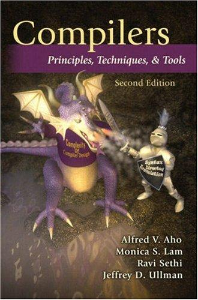
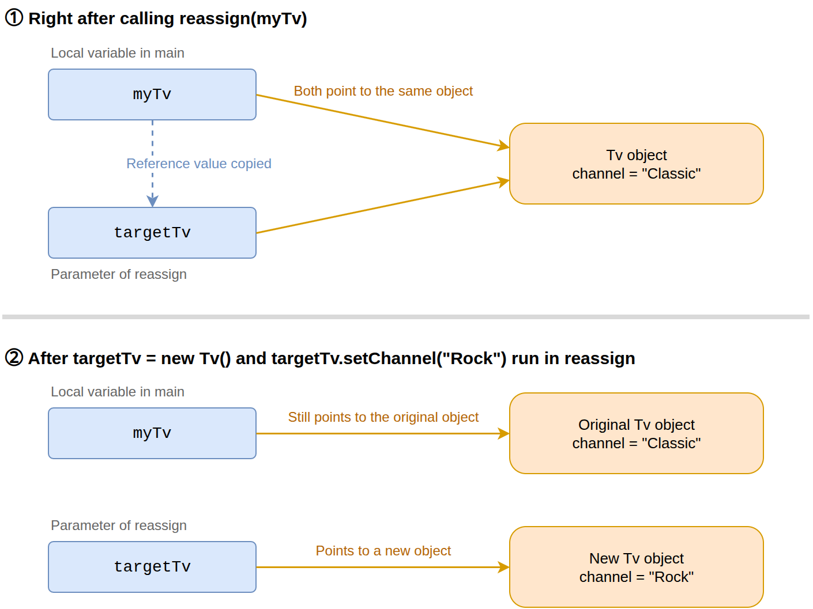
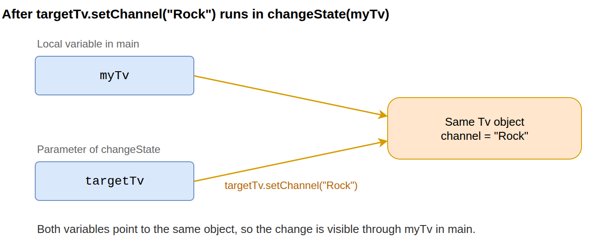
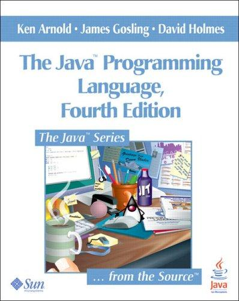
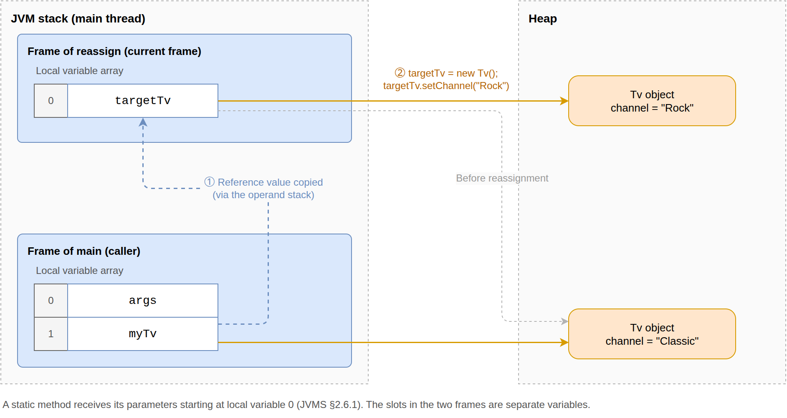

= Call by Value vs. Call by Reference
Sanghyuk Jung
2026-10-03
:jbake-type: post
:jbake-status: published
:jbake-tags: java, javascript, programming-languages
:description: Defines call by value and call by reference from the Dragon Book and Strachey, then compares how Java, Kotlin, JavaScript, C, C++, C#, Python, Go, Rust, and Ada pass arguments to functions.
:jbake-og: {"image": "img/call-by-value/og-call-by-value.png"}
:toc:
:idprefix:

You often hear that "in Java method calls, primitive types are passed by call by value and objects are passed by call by reference."
Java, however, has only call by value.
When you pass an object to a method, the value that gets copied is simply a reference that points to the object.
This article lays out the definitions of the two terms and compares how Java, Kotlin, JavaScript, C, {cpp}, C#, Python, Go, Rust, and Ada pass arguments.

== Call by Value and Call by Reference

**Call by value** initializes a separate variable, the parameter, with the value passed as the argument. The value is usually copied, though some languages such as Rust move ownership instead. Assigning a different value to the parameter inside the function does not affect the caller's variable.

**Call by reference** passes the variable itself. The parameter becomes an alias of the caller's variable, so assigning a new value to the parameter inside the function also changes the caller's variable.

These definitions follow the standard treatment in programming language theory.

Section 1.6.6 of **Compilers: Principles, Techniques, and Tools**, 2nd edition, describes the two mechanisms as follows.

[quote, "Alfred V. Aho, Monica S. Lam, Ravi Sethi, Jeffrey D. Ullman", "Compilers: Principles, Techniques, and Tools, 2nd edition, Section 1.6.6"]
____
In call-by-value, the actual parameter is evaluated (if it is an expression) or copied (if it is a variable). The value is placed in the location belonging to the corresponding formal parameter of the called procedure. This method is used in C and Java, and is a common option in C++, as well as in most other languages. ...

In call-by-reference, the address of the actual parameter is passed to the callee as the value of the corresponding formal parameter. Uses of the formal parameter in the code of the callee are implemented by following this pointer to the location indicated by the caller. Changes to the formal parameter thus appear as changes to the actual parameter.
____

The "actual parameter" in the quote corresponds to what this article calls an argument, and the "formal parameter" corresponds to what this article calls a parameter. Together with its 1977 predecessor **Principles of Compiler Design**, this book has served as the standard textbook for university compiler courses. Its cover illustration earned it the nickname "the Dragon Book."

.Cover of Compilers: Principles, Techniques, and Tools, 2nd edition (image source: https://openlibrary.org/isbn/9780321486813[Open Library])

Christopher Strachey explained the distinction in terms of L-values and R-values in Section 3.4.2 of https://www.cs.cmu.edu/~crary/819-f09/Strachey67.pdf[Fundamental Concepts in Programming Languages], his 1967 lecture notes. He called passing the R-value of an expression to a parameter call by value, and passing its L-value call by reference.

[quote, Christopher Strachey, "Fundamental Concepts in Programming Languages, Section 3.4.2"]
____
When the function is used (or called or applied) we write f[ε] where ε can be an expression. If we are using a referentially transparent language all we require to know about the expression ε in order to evaluate f[ε] is its value. There are, however, two sorts of value, so we have to decide whether to supply the R-value or the L-value of ε to the function f. Either is possible, so that it becomes a part of the definition of the function to specify for each of its bound variables (also called its formal parameters) whether it requires an R-value or an L-value. These alternatives will also be known as calling a parameter by value (R-value) or reference (L-value).
____

An L-value is the storage location denoted by an expression on the left side of an assignment, and an R-value is the value stored in that location, denoted by an expression on the right side. These lecture notes are a classic of programming language theory and are still cited as the origin of terms such as L-value, R-value, and first-class object.

A practical test for telling the two mechanisms apart fits in one sentence: *When a function assigns a new value to its parameter, does the caller's variable change?* If it does, the mechanism is call by reference; if it does not, it is call by value. The test holds under the assumptions of this article: only these two mechanisms are compared, the argument is a reassignable variable, and the parameter can be assigned to. Once other evaluation strategies such as call by copy-restore and call by name come into play, this question alone cannot classify every argument-passing mechanism.

The assignment in this test means putting a different value into the parameter variable itself, as in `targetTv = new Tv()`. If the parameter points to an object, this makes it point to a different object. Changing the internal state of the object the parameter points to, as in `targetTv.setChannel("Rock")`, is a separate matter. The misconception discussed later comes from confusing the two.

=== The Terms "Pass by" and "Call by"

Call by value and call by reference are also called pass by value and pass by reference. The `call by ~` form dates back to the ALGOL 60 report published in 1960. Section 4.7.3 of the https://www.masswerk.at/algol60/report.htm[revised report of 1963] specifies how parameters are passed, with 4.7.3.1 titled "Value assignment (call by value)" and 4.7.3.2 titled "Name replacement (call by name)." The `pass by ~` form is also widely used in practice and in textbooks. This article uses `call by ~` throughout.

=== Call by Sharing

The argument-passing behavior of Java, JavaScript, and Python, which shares an object rather than the caller's variable itself, is sometimes called **call by sharing**. The term comes from the https://csg.csail.mit.edu/pubs/memos/Memo-112/memo112-1a.pdf[design document of CLU], a language created in the mid-1970s by a team led by Barbara Liskov. The object-argument behavior of Java, Kotlin, JavaScript, and Python and the passing of class instances in C#, all covered later, fall into this category. The term "call by object reference" used in the Python tutorial means the same thing. The same structure appears when you pass a map or a pointer in Go, or a pointer in C.

"Call by value" can mislead people into thinking the whole object is copied, and "call by reference" can mislead them into thinking that reassignment is reflected in the caller's variable. Call by sharing is a good term for avoiding both misconceptions. Some sources use it, such as the MDN JavaScript documentation quoted later, but it has not become a standard term in textbooks or language specifications. This article therefore continues with only the two categories of call by value and call by reference.

== Java

=== Result of the swap Method

The output of the following code shows how Java passes arguments.

[source,java]
.Testing a swap method
----
public class ReferenceTest {
    public static void main(String[] args) {
        String x1 = "Hello";
        String y1 = "World";
        swap(x1, y1); // <1>
        System.out.println(x1); // Hello

        int x2 = 1;
        int y2 = 2;
        swap(x2, y2); // <2>
        System.out.println(x2); // 1
    }

    static void swap(Object x, Object y) {
        Object temp = x;
        x = y; // <3>
        y = temp;
    }

    static void swap(int x, int y) {
        int temp = x;
        x = y;
        y = temp;
    }
}
----
<1> Copies of the reference values held by `x1` and `y1` are assigned to the parameters `x` and `y`.
<2> The int values are copied into the parameters of the `swap(int, int)` overload. Without this overload, references to autoboxed Integer objects would be passed to the `Object` parameters, with the same result.
<3> Assigning each other's values to the parameters `x` and `y` inside the method does not change the caller's `x1`, `y1`, `x2`, or `y2`.

By the test defined above, Java behaves as call by value for both primitive types and objects.

=== Why Reassigning a Parameter Does Not Affect the Caller's Variable

Let's look more closely at passing an object as a method parameter.

[source,java]
.Reassigning a parameter inside a method
----
class Tv {
    private String channel;

    void setChannel(String channel) { this.channel = channel; }
    String getChannel() { return channel; }
}

public class ReassignTest {
    public static void main(String[] args) {
        var myTv = new Tv();
        myTv.setChannel("Classic");

        reassign(myTv); // <1>
        System.out.println(myTv.getChannel()); // Classic
    }

    static void reassign(Tv targetTv) {
        targetTv = new Tv(); // <2>
        targetTv.setChannel("Rock");
    }
}
----
<1> The reference value held by `myTv` in the main method is copied and assigned to the parameter `targetTv` of the reassign method. The two variables point to the same object, but they are different variables.
<2> A new object is assigned to the parameter `targetTv`. Only the parameter `targetTv` now points to the new object, and `myTv` in the main method still points to the original object. That is why the output is `Classic`.

=== Mutating Object State: The Source of the Misconception

If you change the internal state of the object the parameter points to, instead of reassigning the parameter, the changed state is visible through the caller's variable.

[source,java]
.Changing object state inside a method without reassigning the parameter
----
public class ChangeStateTest {
    public static void main(String[] args) {
        var myTv = new Tv();
        myTv.setChannel("Classic");

        changeState(myTv); // <1>
        System.out.println(myTv.getChannel()); // <3>
    }

    static void changeState(Tv targetTv) {
        targetTv.setChannel("Rock"); // <2>
    }
}
----
<1> As in the previous example, the reference value held by `myTv` is copied and assigned to the parameter `targetTv` of the changeState method. The two variables point to the same object.
<2> Without reassigning the parameter `targetTv`, the method changes the channel of the object the parameter points to `Rock`. This is the very object that `myTv` in the main method points to.
<3> Reading the channel through `myTv` in the main method prints `Rock`. The variable did not change, but the state of the object it points to did.

Because the changed state is visible through the caller's variable, the claim that "objects are passed by call by reference" sounds plausible.
As explained above, however, the practical test for the two mechanisms is whether a value assigned to the parameter is reflected in the caller's variable.
The changed state is visible through the caller's variable only because both variables point to the same object, and what is passed is still a copy of the reference value. In other words, it is call by value.

**Head First Java** explains object references with the analogy of a TV remote control. Passing an object does not copy the TV (the object); it copies the remote control (the reference value) that operates the TV. If you change the channel with the copied remote (changing object state), the person holding the original remote sees the new channel too. If you pair the copied remote with a new TV (reassignment, `targetTv = new Tv()`), that remote can no longer operate the original TV, and the original remote is still paired with the original TV.

=== Java References and Terminology Confusion

James Gosling, the creator of Java, addressed this misconception directly in **The Java Programming Language**, which he coauthored.

[quote, "Ken Arnold, James Gosling, David Holmes", "The Java Programming Language, 4th edition"]
____
Some people will say incorrectly that objects are passed "by reference." ... The Java programming language does not pass objects by reference; it passes object references by value.
____

.Cover of The Java Programming Language, 4th edition (image source: https://openlibrary.org/isbn/9780321349804[Open Library])

https://dev.java/learn/classes-objects/calling-methods-constructors/[Dev.java], the current official Java learning site, says the same thing.

[quote, Dev.java, Calling Methods and Constructors]
____
Reference data type parameters, such as objects, are also passed into methods by value. ... when the method returns, the passed-in reference still references the same object as before.
____

The Dragon Book quoted earlier also states in the same section that Java uses call by value exclusively. In the call-by-reference entry that follows, however, it writes that Java behaves as if it used call by reference for anything other than basic types.

[quote, "Alfred V. Aho, Monica S. Lam, Ravi Sethi, Jeffrey D. Ullman", "Compilers: Principles, Techniques, and Tools, 2nd edition, Section 1.6.6"]
____
Even though Java uses call-by-value exclusively, whenever we pass the name of an object to a called procedure, the value received by that procedure is in effect a pointer to the object. Thus, the called procedure is able to affect the value of the object itself. ...

As we noted when discussing call-by-value, languages such as Java solve the problem of passing arrays, strings, or other objects by copying only a reference to those objects. The effect is that Java behaves as if it used call-by-reference for anything other than a basic type such as an integer or real.
____

"Behaves as if it used call-by-reference" refers to the effect: the object is not copied as a whole, and changes the called method makes to the object's state are visible to the caller. The phrase assumes what the book stated earlier, that the actual mechanism is not call by reference.

The word "reference" itself seems to have fed the misconception that Java passes objects by call by reference. Java calls a value that points to an object a "reference," and that word overlaps with the "reference" in "call by reference." Put more precisely, *Java passes the reference value that points to an object by call by value.*

A Java reference is a value that identifies and gives access to an object. You can think of it as a pointer.
The following Java object access

[source,java]
.Accessing a Java object
----
var myTv = new Tv();
myTv.setChannel("Rock");
----

is similar to this {cpp} code that uses a pointer.

[source,cpp]
.{cpp} pointer
----
Tv *myTv = new Tv();
myTv->setChannel("Rock");
----

The Java variable `myTv` holds not the object itself but a value that points to the object. When you pass `myTv` as an argument to another method, this reference value is copied and passed. The {cpp} code above is an analogy for object access and pointer reassignment only; it does not mean that object lifetime management or the actual representation of references are the same.

Let's look at the relevant wording in the JLS (Java Language Specification). The JLS also uses the word "pointer." Section https://docs.oracle.com/javase/specs/jls/se26/html/jls-4.html#jls-4.3.1[4.3.1. Objects] defines reference values as pointers to objects.

[quote, Java Language Specification, 4.3.1. Objects]
____
The reference values (often just references) are pointers to these objects, and a special null reference, which refers to no object.
____

This describes language-level semantics; it does not guarantee that a reference value has the same format as a raw memory address. https://docs.oracle.com/en/java/javase/26/docs/specs/jvms/jvms-2.html#jvms-2.7[JVMS (Java Virtual Machine Specification) 2.7] does not mandate any particular internal structure for objects, and notes that in some implementations a reference may point to a handle rather than to the object data. A handle here is a small intermediate structure between the reference and the object data. The reference points to the handle, and pointers inside the handle in turn point to the object data and the method table. In other words, a reference value may not be the memory address where the object resides.

This description of handles originally described "Sun's current implementation" in the https://web.archive.org/web/20001213164500/http://java.sun.com/docs/books/vmspec/html/Overview.doc.html[first edition of the JVMS (1997)]. The second edition changed the wording to "some of Sun's implementations," and editions after the Oracle acquisition to "some of Oracle's implementations," but the content stayed the same. At the time of the first edition, Sun's JVM was the Classic VM of JDK 1.0 and 1.1, and the "Handleless Objects" section of https://www.oracle.com/java/technologies/whitepaper.html[The Java HotSpot Performance Engine Architecture] explains that the Classic VM used indirect handles. According to the same section, HotSpot, which today's Oracle JDK and OpenJDK share, does not use handles and implements object references as direct pointers to objects.

How arguments are passed in a method call is described in Section https://docs.oracle.com/javase/specs/jls/se26/html/jls-8.html#jls-8.4.1[8.4.1. Formal Parameters].
It says only that the "values" of the argument expressions initialize newly created parameter variables. Nothing in it says that a parameter becomes an alias of the caller's variable, as call by reference was defined above.

[quote, Java Language Specification, 8.4.1. Formal Parameters]
____
When the method or constructor is invoked (§15.12), the values of the actual argument expressions initialize newly created parameter variables, each of the declared type, before execution of the body of the method or constructor.
____

=== A New Frame for Every Method Invocation

The JLS also describes, step by step, how a method invocation is executed. Section https://docs.oracle.com/javase/specs/jls/se26/html/jls-15.html#jls-15.12.4.5[15.12.4.5. Create Frame, Synchronize, Transfer Control] says that once the method to invoke has been determined, a new activation frame is created and the argument values are placed in it.
An activation frame is a region of memory that holds the execution state of a method call, such as its parameters, local variables, and return address, and that disappears when the call ends.

[quote, Java Language Specification, "15.12.4.5. Create Frame, Synchronize, Transfer Control"]
____
Now a new activation frame is created, containing the target reference (if any) and the argument values (if any), as well as enough space for the local variables and stack for the method to be invoked ... The effect of this is to assign the argument values to corresponding freshly created parameter variables of the method, and to make the target reference available as this, if there is a target reference.
____

The argument "values" are assigned to parameter variables freshly created in the new frame, not to the caller's variables. This reaches the same conclusion as Section 8.4.1. The reference to the object on which an instance method is invoked (the target reference) is placed in the new frame in the same way and becomes `this`.

The JVMS defines this frame at the virtual machine level. Section https://docs.oracle.com/en/java/javase/26/docs/specs/jvms/jvms-2.html#jvms-2.6[2.6. Frames] says that a new frame is created on the thread's JVM stack every time a method is invoked, and that each frame has its own array of local variables.

[quote, Java Virtual Machine Specification, 2.6. Frames]
____
A new frame is created each time a method is invoked. ... Frames are allocated from the Java Virtual Machine stack (§2.5.2) of the thread creating the frame. Each frame has its own array of local variables (§2.6.1), ...
____

Parameters are passed through this local variable array, as Section https://docs.oracle.com/en/java/javase/26/docs/specs/jvms/jvms-2.html#jvms-2.6.1[2.6.1. Local Variables] explains.

[quote, Java Virtual Machine Specification, 2.6.1. Local Variables]
____
The Java Virtual Machine uses local variables to pass parameters on method invocation. On class method invocation, any parameters are passed in consecutive local variables starting from local variable 0. On instance method invocation, local variable 0 is always used to pass a reference to the object on which the instance method is being invoked (this in the Java programming language). Any parameters are subsequently passed in consecutive local variables starting from local variable 1.
____

Let's trace how the reference value of `myTv` in the earlier `reassign` example is copied into the parameter `targetTv` within this structure. Two concepts are needed first.

* Operand stack: a last-in, first-out stack, one per frame, that serves as the workspace where JVM instructions pop operands and push results. It is also used to prepare the arguments passed to a method.
* Bytecode: the JVM instructions that javac compiles Java source into and stores in class files. Two instructions appear in this example's call sequence.
** https://docs.oracle.com/en/java/javase/26/docs/specs/jvms/jvms-6.html#jvms-6.5.aload_n[`aload_1`]: pushes the reference value held in local variable 1 of the current frame onto the operand stack.
** https://docs.oracle.com/en/java/javase/26/docs/specs/jvms/jvms-6.html#jvms-6.5.invokestatic[`invokestatic`]: invokes a static method. It pops the argument values from the operand stack, creates a new frame, and stores those values in the new frame's local variables starting from local variable 0.

With these concepts, the call to `reassign` looks like the figure below. Because `reassign` is a static method, the parameter `targetTv` is local variable 0 of the `reassign` frame. The reference value held by `myTv`, which javac assigned to local variable 1 of the `main` frame, is copied into this slot. The JVMS dictates that parameters start at slot 0, but the compiler decides which slot each non-parameter local variable occupies. At the bytecode level, the `aload_1` instruction pushes this reference value onto the operand stack of the `main` frame, and the `invokestatic` instruction pops it and stores it in local variable 0 of the new frame. The two slots are separate storage belonging to different frames, so assigning a new object to `targetTv` leaves `myTv` in the `main` frame pointing to the original object.

Keep in mind that the JVMS defines an abstract machine. It is a model that specifies the rules for how instructions behave, not the memory layout of a particular implementation. The introduction to Chapter 2 of the JVMS leaves the memory layout of run-time data areas to the implementor's discretion. For example, machine code produced by a JIT compiler may keep parameters in CPU registers. Even so, the language semantics, in which the caller's variable and the parameter are separate variables, do not change.

== Kotlin

Kotlin does not support call by reference either. In Kotlin, however, you cannot even run this article's test of whether assigning a new value to a parameter changes the caller's variable. The Function declaration section of the https://kotlinlang.org/spec/declarations.html#function-declaration[Kotlin Language Specification] states that each parameter is introduced as the name of a value inside the function body, so parameters are final and cannot be changed inside the function.

[quote, Kotlin Language Specification, Function declaration]
____
Each parameter p~i~: P~i~ = v~i~ introduces p~i~ as a name of value with type P~i~ available inside function body b; therefore, parameters are final and cannot be changed inside the function.
____

Code that assigns a new value to a parameter is a compile error.

[source,kotlin]
.Reassigning a parameter and changing object state in Kotlin
----
class Tv(var channel: String)

fun main() {
    val myTv = Tv("Classic")
    changeState(myTv)
    println(myTv.channel) // Rock
}

fun reassign(targetTv: Tv) {
    targetTv = Tv("Rock") // <1>
}

fun changeState(targetTv: Tv) {
    targetTv.channel = "Rock" // <2>
}
----
<1> This is a compile error with the message "'val' cannot be reassigned."
<2> Changing a property of the object the parameter points to makes the new value visible to the caller. If you delete the `reassign` function that fails to compile and run the code, it prints `Rock`.

Apart from reassignment being forbidden, Kotlin behaves like Java. On the JVM, what is passed is a copy of the reference value, as in Java. Because final parameters are part of the language specification, this does not change when you compile to non-JVM platforms such as Kotlin/JS or Kotlin/Native.

== JavaScript

JavaScript behaves the same way as Java. Here is the swap example first.

[source,javascript]
.JavaScript swap function
----
function swap(x, y) {
  const temp = x;
  x = y;
  y = temp;
}

let x1 = "Hello";
let y1 = "World";
swap(x1, y1);
console.log(x1); // Hello
----

When an object is passed, reassigning the parameter or changing the object's state inside the function also gives the same results as in Java.

[source,javascript]
.Reassignment and state change when passing an object in JavaScript
----
const myTv = { channel: "Classic" };

reassign(myTv);
console.log(myTv.channel); // Classic

changeState(myTv);
console.log(myTv.channel); // Rock

function reassign(targetTv) {
  targetTv = { channel: "Rock" }; // <1>
}

function changeState(targetTv) {
  targetTv.channel = "Rock"; // <2>
}
----
<1> Assigning a new object to the parameter `targetTv` does not change the caller's `myTv`.
<2> Changing a property of the object the parameter points to makes the new value visible through the caller's `myTv`.

Replace the `Tv` object in the two Java figures above with an object literal, and they describe JavaScript's behavior.

The https://developer.mozilla.org/en-US/docs/Web/JavaScript/Reference/Functions#passing_arguments[Functions page on MDN] summarizes this behavior in the same terms: arguments are always passed by value, and object arguments are, more precisely, passed by sharing.

[quote, MDN Web Docs, Functions - Passing arguments]
____
Arguments are always passed by value and never passed by reference. This means that if a function reassigns a parameter, the value won't change outside the function. More precisely, object arguments are passed by sharing, which means if the object's properties are mutated, the change will impact the outside of the function.
____

The ECMAScript specification also describes this behavior as initializing new parameter bindings with argument values, not as creating aliases of the caller's variables. https://tc39.es/ecma262/2026/multipage/ecmascript-language-expressions.html#sec-argument-lists-runtime-semantics-argumentlistevaluation[ArgumentListEvaluation] obtains values from the argument expressions with `GetValue` and builds a list of ECMAScript language values, and https://tc39.es/ecma262/2026/multipage/ordinary-and-exotic-objects-behaviours.html#sec-functiondeclarationinstantiation[FunctionDeclarationInstantiation] initializes the parameter bindings of the new function environment from that list.

Unlike Java, the ECMAScript specification does not call the value used to access an object a "reference value." Object is one of the eight ECMAScript language types, the kinds of values a program manipulates directly, and an object itself is a value of that type. The "copied reference value" in this article is therefore best understood as a model for explaining the observed behavior.

TypeScript passes arguments the same way as JavaScript. The https://www.typescriptlang.org/docs/handbook/typescript-from-scratch.html#runtime-behavior[TypeScript Handbook] states that, as a principle, TypeScript does not change the runtime behavior of JavaScript code.

[quote, TypeScript Handbook, TypeScript for the New Programmer - Runtime Behavior]
____
As a principle, TypeScript never changes the runtime behavior of JavaScript code.
____

After type checking, the TypeScript compiler erases the type information and emits plain JavaScript, so argument passing is identical to the JavaScript behavior described above. TypeScript also has no syntax for reference parameters like C#'s `ref` and `out`, which are covered later.

=== The By Reference Wording in JavaScript: The Definitive Guide

Some sources make it easy to mistake JavaScript function calls for call by reference if you read only part of them. https://docstore.mik.ua/orelly/webprog/jscript/ch11_02.htm[**JavaScript: The Definitive Guide**, 4th edition], written by David Flanagan and long regarded as the standard JavaScript book, has a summary table in Section 11.2, "By Value Versus by Reference," stating that objects are copied, passed, and compared by reference. From that table alone, it looks as if you could describe JavaScript as call by reference.

Read the explanation of the behavior in the same section, however, and the book's "by reference" turns out to mean something different from the call by reference defined at the beginning of this article. The book uses the phrase to mean that a reference to the object is passed instead of the whole object value being copied, and it also explains that reassigning the parameter is not reflected in the caller's variable.

[quote, David Flanagan, "JavaScript: The Definitive Guide, 4th edition, 11.2 By Value Versus by Reference"]
____
A function can use the reference to modify properties of the object or elements of the array. But if the function overwrites the reference with a reference to a new object or array, that modification is not visible outside of the function. Readers familiar with the other meaning of this term may prefer to say that objects and arrays are passed by value, but the value that is passed is actually a reference rather than the object itself.
____

The example that follows this explanation is titled "References themselves are passed by value." The observed behavior the book describes is the same as in this article; only the name for what is passed differs.

== C

C has no syntax like {cpp} reference parameters, so it has only call by value. Paragraph 4 of 6.5.2.2 Function calls in the C11 working draft https://www.open-std.org/jtc1/sc22/wg14/www/docs/n1570.pdf[N1570] states that, in preparing a function call, the arguments are evaluated and each parameter is assigned the value of the corresponding argument.

[quote, C11 Working Draft N1570, "6.5.2.2 Function calls, paragraph 4"]
____
In preparing for the call to a function, the arguments are evaluated, and each parameter is assigned the value of the corresponding argument.
____

Footnote 93, attached to the same paragraph, explains that a function may change the values of its parameters, but these changes cannot affect the values of the arguments; on the other hand, it is possible to pass a pointer to an object, and the function may then change the value of the object pointed to.

[source,c]
.swap implemented with C pointer parameters
----
void swap(int* x, int* y) {
    int temp = *x;
    *x = *y; // <1>
    *y = temp;
}

int a = 1;
int b = 2;
swap(&a, &b); // <2>
----
<1> Writing to the variable the pointer points to changes the caller's `a`. Assigning a different address to `x`, however, leaves the caller's `a` unchanged.
<2> `&` is just the address-of operator, and copies of the pointer values are assigned to the parameters `x` and `y`. After the call, `a` is 2 and `b` is 1.

Applying the test from above, assigning a new value to a pointer parameter does not change the caller's variable, so this is call by value. It has the same structure as Java passing a reference value to an object.

== {cpp}

{cpp} provides reference parameters, which are call by reference as this article defines it.

[source,cpp]
.swap implemented with {cpp} reference parameters
----
void swap(int& x, int& y) { // <1>
    int temp = x;
    x = y; // <2>
    y = temp;
}

int a = 1;
int b = 2;
swap(a, b); // <3>
----
<1> Declaring the parameter with type `int&` makes `x` an alias of the caller's variable `a`.
<2> An assignment inside the function actually changes the caller's variable.
<3> Unlike C's `swap(&a, &b)`, nothing at the call site indicates that an address is passed. After the call, `a` is 2 and `b` is 1.

=== Pointer Parameters vs. Reference Parameters

{cpp} also has the pointer parameters (for example, `int*`) inherited from C, so the two need to be distinguished. Pointer parameters are call by value in {cpp} too. A function that takes pointers, such as `void swap(int* x, int* y)`, receives copies of the pointer values in its parameters, exactly as in the C example. Assigning a different address to `x` inside the function is not reflected in the caller's variable.

An `int&` reference parameter, on the other hand, has no syntax for reseating it at all. `x = y;` is not a statement that rebinds the reference to another variable; it assigns a value to the object the reference refers to. Applying the test from above to the two cases gives different results. Assigning to a pointer parameter (`int*`) leaves the caller's variable unchanged, while assigning to a reference parameter (`int&`) changes it.

=== References in the {cpp} Standard

The {cpp} standard also describes a reference as an alias, not as a value that is passed. A note in https://timsong-cpp.github.io/cppwp/n4950/dcl.ref[[dcl.ref\]] says that a reference can be thought of as "a name of an object." Paragraph 4 of the same section explicitly leaves unspecified whether a reference requires storage.

[quote, {cpp} Working Draft N4950, "[dcl.ref] paragraph 4"]
____
It is unspecified whether or not a reference requires storage ([basic.stc]).
____

Even though compilers usually implement references as addresses, the standard does not even specify whether a reference has storage.

If you judge by what is copied at the machine level, no language would have call by reference at all. The two terms distinguish the semantics a language defines, not the compiled result.

That said, the {cpp} standard does not call reference parameters call by reference. Searching the entire standard turns up no occurrence of "call by value," "call by reference," or "pass by value," and only four occurrences of "passed by reference," all in notes or library clauses rather than normative definitions. Instead of naming evaluation strategies, the standard specifies behavior. Paragraph 6 of https://timsong-cpp.github.io/cppwp/n4950/expr.call[[expr.call\]] says only that each parameter is initialized with its corresponding argument.

[quote, {cpp} Working Draft N4950, "[expr.call] paragraph 6"]
____
When a function is called, each parameter ([dcl.fct]) is initialized ([dcl.init], [class.copy.ctor]) with its corresponding argument.
____

How a parameter of reference type is initialized is governed separately by the reference binding rules. Call by value and call by reference are not standard terms of any particular language; they are programming language theory terms for comparing argument-passing mechanisms across languages.

== C#

Like {cpp}, C# supports call by reference in its syntax. The https://learn.microsoft.com/en-us/dotnet/csharp/language-reference/keywords/method-parameters[Method parameters page of the C# reference] states that C# passes arguments by value by default, and that a method receives a copy of the value for value types such as structs and a copy of the reference for reference types such as classes.

[quote, C# reference, Method parameters and modifiers]
____
By default, C# passes arguments to functions by value. This approach passes a copy of the variable to the method. For value (struct) types, the method gets a copy of the value. For reference (class) types, the method gets a copy of the reference.
____

The page goes on to explain that when a reference type is passed by value, reassigning the parameter inside the method does not change the caller's variable, while changing an instance member is visible through the caller's variable because both variables refer to the same instance. So far, this is the same as Java.

To pass a parameter by reference, you add the `ref`, `out`, `in`, or `ref readonly` modifier. Of these, only `ref` and `out` allow assigning to the caller's variable. The same page explains that a parameter passed by reference has no value of its own; it is a reference variable that refers to another variable, the referent. This is call by reference as defined in this article: the parameter becomes an alias of the caller's variable.

[source,csharp]
.Swap implemented with C# ref parameters
----
void Swap(ref int x, ref int y) // <1>
{
    int temp = x;
    x = y; // <2>
    y = temp;
}

int a = 1;
int b = 2;
Swap(ref a, ref b); // <3>
----
<1> The parameter `x`, declared with the `ref` modifier, becomes an alias of the caller's variable `a`.
<2> Assigning to the parameter changes the caller's variable.
<3> Unlike {cpp}, the call site also needs `ref`. After the call, `a` is 2 and `b` is 1.

Because a `ref` parameter requires `ref` at both the method declaration and the call site, you can tell from the call expression alone that the caller's variable may change, unlike with {cpp} reference parameters. `out` is a variant in which the caller passes an uninitialized variable and the method must assign a value to it, and `in` and `ref readonly` are read-only references that the method cannot modify.

`ref` also works with variables of reference types. Passing a class instance as is copies the reference, as in Java, so reassigning the parameter is not reflected in the caller's variable. Passing it with `ref` makes the parameter an alias of the caller's variable, so reassignment can change which object the caller's variable points to.

[source,csharp]
.Replacing the caller's reference-type variable with a C# ref parameter
----
var myTv = new Tv();
myTv.Channel = "Classic";

Replace(ref myTv); // <1>
Console.WriteLine(myTv.Channel); // Rock

void Replace(ref Tv targetTv)
{
    targetTv = new Tv(); // <2>
    targetTv.Channel = "Rock";
}

class Tv
{
    public string Channel { get; set; } = "";
}
----
<1> If you declare it as `Replace(Tv targetTv)` without `ref` and call `Replace(myTv)`, it behaves like Java's `reassign(myTv)` and prints `Classic`. If the declaration has `ref` and you omit only the `ref` at the call site, it is a compile error.
<2> Assigning a new object to the `ref` parameter makes the caller's `myTv` point to the new object. Running it on .NET 8 prints `Rock`.

C# distinguishes in its syntax between "passing a reference type by value" and "passing a variable by reference with ref," two different behaviors.

== Python

Like Java, Python has only call by value. Section https://docs.python.org/3/tutorial/controlflow.html#defining-functions[4.8 Defining Functions] of the official tutorial explains that arguments are introduced into the local symbol table of the called function, so they are passed using call by value, where the value is always an object reference.

[quote, The Python Tutorial, 4.8 Defining Functions]
____
The actual parameters (arguments) to a function call are introduced in the local symbol table of the called function when it is called; thus, arguments are passed using call by value (where the value is always an object reference, not the value of the object).
____

A footnote on this sentence adds that "call by object reference" would be a better description, because when a mutable object is passed, the caller sees any changes made to it. The https://docs.python.org/3/faq/programming.html#how-do-i-write-a-function-with-output-parameters-call-by-reference[Python FAQ] answers more directly: arguments are passed by assignment, and since assignment just creates references to objects, there is no alias between an argument name in the caller and in the callee, and so no call by reference.

[source,python]
.Python swap function and passing an object
----
def swap(x, y):
    x, y = y, x  # <1>

a, b = 1, 2
swap(a, b)
print(a)  # 1

class Tv:
    def __init__(self, channel):
        self.channel = channel

def main():
    my_tv = Tv("Classic")
    reassign(my_tv)
    print(my_tv.channel)  # Classic
    changeState(my_tv)
    print(my_tv.channel)  # Rock

def reassign(targetTv):
    targetTv = Tv("Rock")  # <2>

def changeState(targetTv):
    targetTv.channel = "Rock"  # <3>

main()
----
<1> This only rebinds the local names `x` and `y` to different objects, so the caller's `a` stays 1.
<2> Rebinding the parameter `targetTv` to a new object leaves the caller's `my_tv` unchanged, and `Classic` is printed.
<3> Changing an attribute of the object `targetTv` points to makes the change visible through the caller's `my_tv`, and `Rock` is printed.

The results are the same as Java's `Tv` example and JavaScript's `reassign` and `changeState` examples.

Because the caller's variable stays the same when you pass an integer or a string, but appears changed when you pass a list or a dictionary, it is easy to assume the passing rule depends on the type. The rule is the same. Integers and strings are immutable objects, so there is simply no way to change their internal state. Even with a list, rebinding the parameter inside the function, as in `x = [1]`, leaves the caller unchanged.

== Go

Go does not make the caller's variable an implicit alias of a parameter in a function call either. The Calls section of the https://go.dev/ref/spec#Calls[Go specification] says that after the function value and arguments are evaluated, new storage is allocated for the function's variables, including its parameters and results, and the arguments are assigned to the corresponding parameters. The https://go.dev/doc/faq#pass_by_value[Go FAQ] answers more directly.

[quote, Go FAQ, When are function parameters passed by value?]
____
As in all languages in the C family, everything in Go is passed by value. That is, a function always gets a copy of the thing being passed, as if there were an assignment statement assigning the value to the parameter.
____

Taken literally, "all languages in the C family" is not accurate. {cpp} and C#, covered in this article, belong to the C family but support reference parameters in their syntax. Both languages still pass by value by default, though, and passing by reference is an exception that requires a modifier. The sentence is best read as "the default in C-family languages is pass by value, and Go has only that default." As in C, Go requires you to pass a pointer explicitly to change the caller's variable.

[source,go]
.swap implemented with Go pointer parameters
----
func swap(x, y *int) {
    *x, *y = *y, *x // <1>
}

a, b := 1, 2
swap(&a, &b) // <2>
----
<1> Writing to the variables the pointers point to changes the caller's `a` and `b`. Assigning a different pointer to `x` inside the function does not change the caller's `a`.
<2> To change the caller's values with an ordinary function, you pass pointers as in C. Copies of the pointer values are assigned to the parameters `x` and `y`. After the call, `a` is 2 and `b` is 1.

Method calls, however, do not need `&` at the call site. The https://go.dev/ref/spec#Calls[Calls section of the Go specification] states that if `x` is addressable and the method set of `&x` contains `m`, then `x.m()` is shorthand for `(&x).m()`. For methods with pointer receivers, the compiler takes the address for you under this rule, so you cannot tell from the shape of the call expression alone whether the caller's variable may change. Even then, what is passed is a pointer value.

== Rust

Rust does not support call by reference in the sense defined in this article, a mechanism in which the parameter becomes an alias of the caller's variable. https://doc.rust-lang.org/rust-by-example/scope/borrow.html[Rust by Example] calls passing a `&T` "passed by reference." A function call, however, does not create an alias of the caller's variable, and a reference such as `&mut T` is itself a value that is passed by call by value. The https://doc.rust-lang.org/book/ch04-01-what-is-ownership.html#ownership-and-functions[Rust Book] explains that passing a variable to a function moves or copies the value, just as assignment does.

[quote, The Rust Programming Language, 4.1 What is Ownership? - Ownership and Functions]
____
Passing a variable to a function will move or copy, just as assignment does.
____

To understand "move" in this explanation, you need Rust's concept of ownership. The https://doc.rust-lang.org/book/ch04-01-what-is-ownership.html#ownership-rules[Ownership Rules section of the Rust Book] summarizes ownership in three rules: each value has a variable that is its owner, there can be only one owner at a time, and when the owner goes out of scope, the value is dropped. An assignment such as `let s2 = s1;` transfers ownership to `s2`, which is called a move, and using `s1` after the move is a compile error.

Which types are copied is determined by the `Copy` trait.
A https://doc.rust-lang.org/book/ch10-02-traits.html[trait] declares behavior shared by multiple types, similar to an interface in other languages. Some traits have no methods and only tell the compiler about a property of the type; `Copy` is one of them.

`Copy` is a trait for types whose original variable remains usable after its value is assigned to another variable. The https://doc.rust-lang.org/book/ch04-01-what-is-ownership.html#stack-only-data-copy[Stack-Only Data: Copy section of the Rust Book] explains that variables of types implementing `Copy` are not moved but trivially copied, so they remain valid after assignment to another variable. Integers, floating-point numbers, `bool`, `char`, and tuples containing only `Copy` types belong to this group. Types that allocate heap memory or own resources, such as `String` and `Vec`, cannot be `Copy`, and adding `Copy` to a type that implements `Drop`, which performs cleanup when a value goes out of scope, is a compile error. In effect, only types that are safe to duplicate bit for bit can be `Copy`. So in `let t = s;`, if `s` is an `i32` you can keep using `s` afterward, but if it is a `String` it is moved, as shown above.

A value of a non-`Copy` type such as `String` has its ownership moved into the parameter, and a value of a `Copy` type such as `i32` is copied. When you pass a variable of type `&mut T` to a parameter of type `&mut T`, however, the compiler implicitly reborrows it, so you can use the variable again after the call even though `&mut T` is not `Copy`.

From this article's perspective, moving and copying are the same mechanism, in which the parameter is initialized with the argument value, and neither creates an alias of the caller's variable. The only difference is whether the caller's variable remains usable after the call.

[source,rust]
.swap implemented with Rust mutable references
----
fn swap(x: &mut i32, y: &mut i32) { // <1>
    let temp = *x;
    *x = *y; // <2>
    *y = temp;
}

let mut a = 1;
let mut b = 2;
swap(&mut a, &mut b); // <3>
----
<1> What is passed to the parameter `x` is a value of type `&mut i32`.
<2> Writing to the variable the mutable reference points to changes the caller's `a`.
<3> To change the caller's values with an ordinary function, you pass mutable references like this. After the call, `a` is 2 and `b` is 1.

The standard library function https://doc.rust-lang.org/std/mem/fn.swap.html[`std::mem::swap`] uses the same approach with the signature `fn swap<T>(x: &mut T, y: &mut T)`. Passing mutable references is still not call by reference as defined in this article, in which reassigning the parameter itself changes the caller's variable binding. To reassign `x`, you have to declare the parameter as `mut x: &mut i32`, and even then the reassignment has no effect on the caller's `a`.

Like Go's pointer-receiver methods, method calls in Rust do not need `&mut` at the call site. Under the https://doc.rust-lang.org/reference/expressions/method-call-expr.html#r-expr.method.autoref-deref[method call rules in the Rust Reference], writing `v.push(1)` makes the compiler automatically borrow the receiver and pass `&mut v`, and what is passed is still a mutable reference value.

== Ada: Call by Reference vs. Copy-Restore

The definitions section noted that the test "when a function assigns a new value to its parameter, does the caller's variable change?" cannot classify every passing mechanism by itself. Ada is an example. Ada declares parameters with the modes `in`, `in out`, and `out`, and a value assigned to an `in out` or `out` parameter is reflected in the caller's variable. Judged only by the result the caller observes, this is the same as {cpp} reference parameters.

https://ada-lang.io/docs/arm/AA-6/AA-6.2/[Ada Reference Manual 6.2], however, decides whether a parameter is passed by copy or by reference mainly by its type, not its mode. Elementary types such as `Integer` are by-copy types and are passed by copy; by-reference types such as tagged types are passed by reference; and a formal parameter declared `aliased` is passed by reference regardless of its type. For parameters that fall into neither category, the manual does not specify whether they are passed by copy or by reference and leaves the choice to the implementation. For `in out` and `out` parameters passed by copy, https://ada-lang.io/docs/arm/AA-6/AA-6.4[6.4.1] specifies that their values are copied back to the actual arguments when the subprogram completes normally. This is the call by copy-restore mentioned in the definitions section. The result, a changed caller variable, is the same as with call by reference, but the actual mechanism is copying.

The difference between passing by copy and passing by reference becomes visible when the procedure reads the variable passed as the actual argument directly. The example below passes the same variable `Original` to a procedure that receives it by copy and to one that receives it as `aliased`, and reads `Original` right after assigning to the parameter.

[source,ada]
.By-copy passing vs. aliased by-reference passing in Ada
----
with Ada.Text_IO; use Ada.Text_IO;

procedure Demo is
   Original : aliased Integer := 1;

   procedure By_Copy (Param : in out Integer) is
   begin
      Param := 2;
      Put_Line ("inside By_Copy: Original =" & Integer'Image (Original)); -- <1>
   end By_Copy;

   procedure By_Reference (Param : aliased in out Integer) is
   begin
      Param := 2;
      Put_Line ("inside By_Reference: Original =" & Integer'Image (Original)); -- <3>
   end By_Reference;
begin
   By_Copy (Original);
   Put_Line ("after By_Copy: Original =" & Integer'Image (Original)); -- <2>

   Original := 1;
   By_Reference (Original);
   Put_Line ("after By_Reference: Original =" & Integer'Image (Original));
end Demo;
----
<1> `Integer` is a by-copy type, so `Param` is a copy of `Original`. Right after 2 is assigned to `Param`, `Original` is still 1.
<2> When the procedure completes normally, the value of `Param` is copied back to `Original`, and `Original` becomes 2.
<3> An `aliased` parameter is passed by reference, so `Param` is an alias of `Original`. The moment 2 is assigned to `Param`, `Original` is 2 as well.

This is the output when compiled with GNAT 13.3, the Ada compiler included in GCC.

[source,text]
.Output
----
inside By_Copy: Original = 1
after By_Copy: Original = 2
inside By_Reference: Original = 2
after By_Reference: Original = 2
----

After both calls return, the value is 2 in both cases, but reading `Original` inside the procedures gives different results. A language supporting parameter modes in its syntax and those modes being implemented as call by reference are two separate facts.

== Summary

The following table summarizes how the languages covered in this article pass arguments.

[cols="1,2,3,3",options="header"]
|===
|Language|Supports call by reference|Passing mechanism|Changing the caller's variable through a parameter

|Java|No|Call by value. For objects, a copy of the reference value is passed|Not possible. Only object state changes are shared
|Kotlin|No|Call by value. Parameters are final, so reassignment is a compile error|Not possible. Only object state changes are shared
|JavaScript|No|Call by value. The Object value is assigned to a separate parameter binding|Not possible. Only object state changes are shared
|C|No|Call by value|Pass a pointer (`swap(&a, &b)`)
|{cpp}|Yes, only for reference parameters (`int&`)|Call by value by default. Only reference parameters are call by reference|Declare a reference parameter. You can also pass a pointer as in C
|C#|Yes, with `ref`, `out`, `in`, and `ref readonly` parameters. Of these, `ref` and `out` allow assigning to the parameter|Call by value by default. For class instances, a copy of the reference is passed|Declare a `ref` or `out` parameter. The call site also needs `ref` or `out`
|Python|No|Call by value. The value is always an object reference|Not possible. Only object state changes are shared
|Go|No|Call by value. Map and slice values behave like pointers|Pass a pointer (`swap(&a, &b)`). Pointer-receiver methods take the address automatically
|Rust|No|Call by value. Depending on the type, the value is moved or copied as in assignment, and a mutable reference `&mut T` is also passed by value|Pass a mutable reference (`swap(&mut a, &mut b)`). Method calls borrow the receiver automatically
|Ada|Partially. By-reference types and parameters declared `aliased` are passed by reference regardless of mode. For other types, the manual does not specify. `in out` and `out` parameters of by-copy types are copied back on normal completion (copy-restore)|By copy or by reference, depending on the type|Declare an `in out` or `out` mode
|===

* Java, Kotlin, JavaScript, and Python initialize a separate parameter variable or binding with the argument value. They do not support call by reference, in which the caller's variable itself becomes an alias of the parameter.
** Passing an object neither clones the object nor passes the caller's variable itself. In Java, the reference value that points to the object, and in JavaScript, the Object value, is passed to a separate parameter, and the caller and callee can observe the same object.
** Reassigning a parameter inside a function does not change the caller's variable. Changing the internal state of the object the parameter points to, on the other hand, is visible through the caller's variable. This difference is the source of the misconception that "objects are call by reference."
* C and Go pass pointers, and Rust passes mutable references, to change the caller's values. A call that takes the address or reference of a variable on the spot shows `&` or `&mut`, but when you pass a variable that already holds a pointer or reference, or when the compiler takes the address or borrows for you as in Go and Rust method calls, you cannot tell from the shape of the call expression alone. The only languages here in which a parameter becomes an alias of the caller's variable are {cpp}, C#, and Ada, and Ada sometimes passes by copy and copies back depending on the type.
* This object-sharing behavior is sometimes called call by sharing. Some sources, such as **JavaScript: The Definitive Guide**, 4th edition, describe object sharing as "by reference," but it should be distinguished from call by reference in the sense of passing an alias of the caller's variable.

== References

* Terminology
** Alfred V. Aho, Monica S. Lam, Ravi Sethi, Jeffrey D. Ullman, https://www.pearson.com/en-us/subject-catalog/p/compilers-principles-techniques-and-tools/P200000003472/9780133002140[**Compilers: Principles, Techniques, and Tools**], 2nd edition, Addison-Wesley, 2007, 1.6.6 Parameter Passing Mechanisms
** Christopher Strachey, https://www.cs.cmu.edu/~crary/819-f09/Strachey67.pdf[**Fundamental Concepts in Programming Languages**], Higher-Order and Symbolic Computation, Vol. 13, 2000, 3.4.2 Parameter calling modes
** https://www.masswerk.at/algol60/report.htm[Revised Report on the Algorithmic Language Algol 60 - 4.7.3 Semantics]
** https://csg.csail.mit.edu/pubs/memos/Memo-112/memo112-1a.pdf[CLU design document - Call by sharing]
* Java
** https://docs.oracle.com/javase/specs/jls/se26/html/jls-8.html#jls-8.4.1[Java Language Specification - 8.4.1. Formal Parameters]
** https://docs.oracle.com/javase/specs/jls/se26/html/jls-4.html#jls-4.3.1[Java Language Specification - 4.3.1. Objects]
** https://docs.oracle.com/javase/specs/jls/se26/html/jls-15.html#jls-15.12.4.5[Java Language Specification - 15.12.4.5. Create Frame, Synchronize, Transfer Control]
** https://docs.oracle.com/en/java/javase/26/docs/specs/jvms/jvms-2.html#jvms-2.6[Java Virtual Machine Specification - 2.6. Frames]
** https://docs.oracle.com/en/java/javase/26/docs/specs/jvms/jvms-2.html#jvms-2.6.1[Java Virtual Machine Specification - 2.6.1. Local Variables]
** https://docs.oracle.com/en/java/javase/26/docs/specs/jvms/jvms-2.html#jvms-2.7[Java Virtual Machine Specification - 2.7. Representation of Objects]
** https://docs.oracle.com/javase/specs/jvms/se6/html/Overview.doc.html#16066[Java Virtual Machine Specification (Java SE 6) - 3.7 Representation of Objects]
** https://web.archive.org/web/20001213164500/http://java.sun.com/docs/books/vmspec/html/Overview.doc.html[The Java Virtual Machine Specification, first edition (1997) - 3.7 Representation of Objects (Wayback Machine)]
** https://www.oracle.com/java/technologies/whitepaper.html[The Java HotSpot Performance Engine Architecture - Handleless Objects]
** https://docs.oracle.com/en/java/javase/26/docs/specs/jvms/jvms-6.html#jvms-6.5.invokestatic[Java Virtual Machine Specification - 6.5. invokestatic]
** https://dev.java/learn/classes-objects/calling-methods-constructors/[Dev.java - Calling Methods and Constructors]
** Ken Arnold, James Gosling, David Holmes, https://www.informit.com/store/java-programming-language-9780321349804[**The Java Programming Language**], 4th edition, Addison-Wesley, 2006
** Kathy Sierra, Bert Bates, https://www.oreilly.com/library/view/head-first-java/0596009208/[**Head First Java**], 2nd edition, O'Reilly, 2005, Chapters 3 and 4
* Kotlin
** https://kotlinlang.org/spec/declarations.html#function-declaration[Kotlin Language Specification - Function declaration]
* JavaScript
** https://tc39.es/ecma262/2026/multipage/ecmascript-language-expressions.html#sec-argument-lists-runtime-semantics-argumentlistevaluation[ECMAScript Language Specification - ArgumentListEvaluation]
** https://tc39.es/ecma262/2026/multipage/ordinary-and-exotic-objects-behaviours.html#sec-functiondeclarationinstantiation[ECMAScript Language Specification - FunctionDeclarationInstantiation]
** https://developer.mozilla.org/en-US/docs/Web/JavaScript/Reference/Functions#passing_arguments[MDN Web Docs - Functions, Passing arguments]
** https://www.typescriptlang.org/docs/handbook/typescript-from-scratch.html#runtime-behavior[TypeScript Handbook - TypeScript for the New Programmer, Runtime Behavior]
** David Flanagan, https://www.oreilly.com/library/view/javascript-the-definitive/0596000480/[**JavaScript: The Definitive Guide**], 4th edition, O'Reilly, 2001, https://docstore.mik.ua/orelly/webprog/jscript/ch11_02.htm[11.2 By Value Versus by Reference]
* C
** https://www.open-std.org/jtc1/sc22/wg14/www/docs/n1570.pdf[C11 Working Draft N1570 - 6.5.2.2 Function calls]
* {cpp}
** https://timsong-cpp.github.io/cppwp/n4950/dcl.ref[{cpp} Working Draft N4950 - [dcl.ref\] References]
** https://timsong-cpp.github.io/cppwp/n4950/expr.call[{cpp} Working Draft N4950 - [expr.call\] Function call]
* C#
** https://learn.microsoft.com/en-us/dotnet/csharp/language-reference/keywords/method-parameters#reference-parameters[C# Reference - Reference parameters]
* Python
** https://docs.python.org/3/tutorial/controlflow.html#defining-functions[The Python Tutorial - 4.8 Defining Functions]
** https://docs.python.org/3/faq/programming.html#how-do-i-write-a-function-with-output-parameters-call-by-reference[Python Programming FAQ - How do I write a function with output parameters (call by reference)?]
* Go
** https://go.dev/ref/spec#Calls[The Go Programming Language Specification - Calls]
** https://go.dev/doc/faq#pass_by_value[Go FAQ - When are function parameters passed by value?]
* Rust
** https://doc.rust-lang.org/book/ch04-01-what-is-ownership.html#ownership-rules[The Rust Programming Language - Ownership Rules]
** https://doc.rust-lang.org/book/ch04-01-what-is-ownership.html#ownership-and-functions[The Rust Programming Language - Ownership and Functions]
** https://doc.rust-lang.org/book/ch04-01-what-is-ownership.html#stack-only-data-copy[The Rust Programming Language - Stack-Only Data: Copy]
** https://doc.rust-lang.org/book/ch10-02-traits.html[The Rust Programming Language - Traits: Defining Shared Behavior]
** https://doc.rust-lang.org/std/mem/fn.swap.html[Rust Standard Library - std::mem::swap]
** https://doc.rust-lang.org/reference/expressions/method-call-expr.html[The Rust Reference - Method-call expressions]
* Ada
** https://ada-lang.io/docs/arm/AA-6/AA-6.2/[Ada Reference Manual - 6.2 Formal Parameter Modes]
** https://ada-lang.io/docs/arm/AA-6/AA-6.4[Ada Reference Manual - 6.4 Subprogram Calls, 6.4.1 Parameter Associations]
