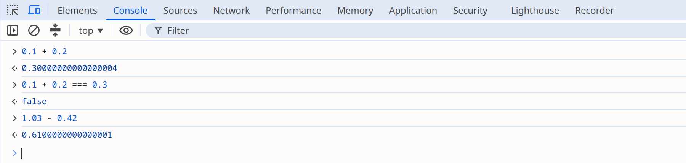
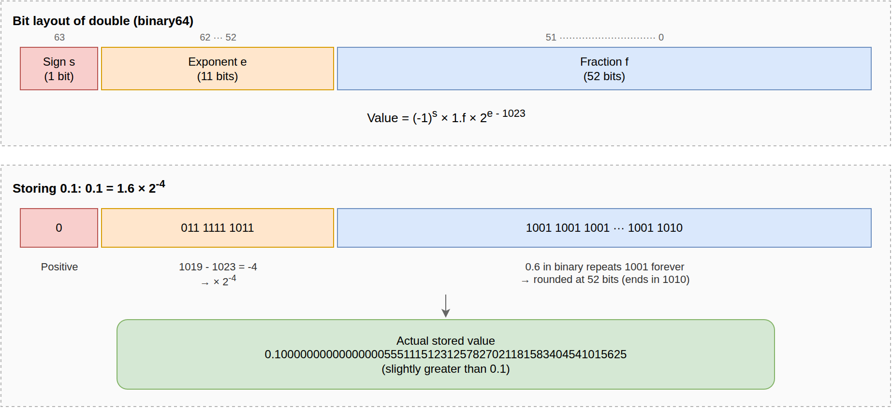

= IEEE 754 Floating-Point Errors and Alternatives in Java
Sanghyuk Jung
2026-10-03
:jbake-type: post
:jbake-status: published
:jbake-tags: java, code-review, floating-point
:description: Why storing 0.1 in a Java double causes a rounding error in the 52-bit IEEE 754 fraction, two failures it caused (NEIS grading and the Patriot missile), and how to choose between BigDecimal, integer minor units, and libraries such as Java Money.
:jbake-og: {"image": "img/floating-point-java/ieee754-double.png"}
:toc:
:sectnums:
:idprefix:

Java's `double` and `float` types store values in binary according to the IEEE 754 floating-point standard.
In this format, the decimal number 0.1 cannot be represented exactly.
In binary, 0.1 is an infinitely repeating fraction, so fitting it into a finite number of bits requires rounding it to the nearest representable value.
This article explains why such errors occur and when they become dangerous, using real failures as examples, and then summarizes the alternatives available in Java.

== Floating-Point Errors in Code

You can see floating-point errors quickly in jshell, the interactive tool included with the JDK since JDK 9.

[source,java]
.Adding decimals
----
jshell> 0.1 + 0.2
$1 ==> 0.30000000000000004

jshell> 0.1 + 0.2 == 0.3
$2 ==> false

jshell> 1.03 - 0.42
$3 ==> 0.6100000000000001
----

Adding 0.1 ten times does not give 1.0.

[source,java]
.Adding 0.1 ten times
----
jshell> double sum = 0;
sum ==> 0.0

jshell> for (int i = 0; i < 10; i++) { sum += 0.1; }

jshell> sum
sum ==> 0.9999999999999999
----

The `BigDecimal` constructor reveals the value actually stored for the `double` literal 0.1.

[source,java]
.The actual value of the double literal 0.1
----
jshell> new BigDecimal(0.1)
$1 ==> 0.1000000000000000055511151231257827021181583404541015625
----

I typed 0.1 at the jshell prompt, but the stored value is greater than 0.1 by about 5.55 × 10^-18^.

This error is not specific to Java.
JavaScript's `number` type also uses the IEEE 754 binary64 format, so entering the same expressions in the Chrome DevTools console gives the same results.

The next section follows the bit layout of `double` to show why these values are stored.

== Bit Layout of double (IEEE 754 binary64) and How 0.1 Is Stored

IEEE 754 is a standard that defines several floating-point formats.
Java uses two of them.

[cols="1,1,2,1", options="header"]
|===
|Format |1985 name |Size |Java type

|binary32
|single
|32 bits (sign 1 / exponent 8 / fraction 23)
|`float`

|binary64
|double
|64 bits (sign 1 / exponent 11 / fraction 52)
|`double`
|===

The first version of the standard, IEEE 754-1985, called these two formats single and double.
The 2008 revision renamed them binary32 and binary64, and these names carry over to the current standard, IEEE 754-2019.
The standard also defines binary16, binary128, and the decimal formats decimal32, decimal64, and decimal128.

The binary formats of IEEE 754 convert a real number to binary scientific notation and then store it as bits.
In decimal scientific notation, you shift the decimal point so that the integer part is a single digit from 1 to 9, and express the number of places shifted as a power of 10.
For example, 0.001 is written as 1.0 × 10^-3^.
Binary works the same way: you multiply or divide by 2 until the integer part is a single digit, that is, until the value is at least 1 and less than 2.
The only nonzero digit in binary is 1, so the normalized result always takes the form ±1.fraction × 2^exponent^.
For example, binary 0.011 (decimal 0.375) is written as 1.1 × 2^-2^.

A `double` (binary64) stores this normalized value in 64 bits according to the following rules.

* The sign (s) is stored in the first bit. 0 means positive and 1 means negative.
* The exponent (e) is stored in 11 bits as the actual exponent plus 1023. This lets exponents from -1022 to 1023 be stored as unsigned integers from 1 to 2046; reading the value subtracts 1023 again. Of the values 0 to 2047 that 11 bits can hold, the two at either end are reserved: 0 represents zero and numbers very close to zero, and 2047 represents infinity and NaN.
* The fraction (f) stores only the part after the binary point of 1.fraction, in 52 bits. The integer part of a normalized number is always 1, so that 1 is omitted.
* If the part after the binary point exceeds 52 bits, it is rounded to the nearest value.

The figure below shows 0.1 stored according to these rules.
The 64 bits are divided into a 1-bit sign, an 11-bit exponent, and a 52-bit fraction.

Let's follow the conversion in the lower half of the figure.
Multiplying 0.1 by 2 repeatedly gives 0.2, 0.4, and 0.8, and on the fourth step it becomes 1.6, which is the first value at least 1 and less than 2.
Since multiplying by 2 four times gave 1.6, 0.1 = 1.6 ÷ 2^4^ = 1.6 × 2^-4^.
The sign bit is therefore 0, and the exponent field is -4 + 1023 = 1019.
The fraction is the problem.
Converting 0.6 to binary gives 0.1001 1001 1001…, with 1001 repeating forever.
Fitting it into 52 bits requires rounding.
The bits following the first 52 are 1001…, so the discarded part is more than half of the last bit's weight.
The value is therefore rounded up, and the last four bits of the fraction change from 1001 to 1010.
As a result, what gets stored is not 0.1 but a number very slightly greater than 0.1.
The value 0.1000000000000000055511151231257827021181583404541015625 seen earlier with `new BigDecimal(0.1)` is exactly this rounded value.

You can see the stored bits in hexadecimal in jshell.

[source,java]
.The 64 bits that store 0.1
----
jshell> Long.toHexString(Double.doubleToLongBits(0.1))
$1 ==> "3fb999999999999a"
----

One hexadecimal digit is 4 bits.
The first three digits, 3fb, are the 12 bits of the 1-bit sign and the 11-bit exponent combined: the sign bit is 0 and the exponent field is 0x3fb, or 1019 in decimal.
The remaining thirteen digits are the 52-bit fraction.
The digit 9 (1001) repeats twelve times, and only the last digit is rounded up to a (1010).

Not every decimal fraction has this error.
Fractions whose denominator is a power of 2, such as 0.5 (1/2), 0.25 (1/4), and 0.75 (3/4), are finite binary fractions, so they are stored exactly as long as they need no more than 53 significant bits.
In contrast, a decimal fraction whose reduced denominator contains a factor of 5, such as 0.1 = 1/10, becomes an infinitely repeating binary fraction and cannot avoid rounding error.
For more detail on the standard, see the https://en.wikipedia.org/wiki/IEEE_754[Wikipedia article on IEEE 754].

== Failures Caused by Binary Representation Errors

In fields that deal with approximations, such as data from scientific experiments, these errors often fall within an acceptable range.
But where values must be exactly equal, such as money and grades, or where errors accumulate across calculations, even a tiny error becomes a critical bug.
Let's look at two cases, one in Korea and one abroad, where such errors led to real failures.

=== The 2011 NEIS Grading Error

In July 2011, a grade-processing error in NEIS, the next-generation National Education Information System of South Korea, changed the end-of-semester class ranks of about 29,000 students at 823 high schools nationwide.
It happened just before the early-admission season for universities, so the impact was large.

NEIS computed a semester total by adding written exam scores and performance assessment scores.
The ranks of students with the same total were decided by a tie-breaking rule that each school chose from 45 options (https://m.yeongnam.com/view.php?key=20110726.010061333590001[Yeongnam Ilbo article, in Korean]).
For example, at a school that gives priority to written exam scores, student A with 65 on the written exam and 25 on performance assessments ranks ahead of student B with 60 and 30, even though both have a total of 90.
Detecting ties is an important step in computing ranks; schools even had to choose a tie-breaking rule in advance.

NEIS was programmed to display totals to 16 decimal places, and some values had a stray '1' appearing irregularly in those decimal places.
This is the same pattern as 1.03 - 0.42 producing 0.6100000000000001 at the beginning of this article.
For example, if two students' totals are computed as 90 and 90.00000000000001, the values are not equal, so a direct comparison treats the two students as not tied and sorts the one with the error as having a higher score.
As a result, students who should have had the same total were not detected as tied, or the ranks among tied students were reversed (https://use.go.kr/news/user/bbs/BD_selectBbs.do?q_bbsSn=1005&q_bbsDocNo=13244[notice from the Ulsan Metropolitan Office of Education, in Korean]).
The Ministry of Education, Science and Technology explained that the bug was caused by not correcting this calculation error (https://www.khan.co.kr/article/201107222144165[Kyunghyang Shinmun article, in Korean]).

jshell shows that adding the same numbers in a different order can produce a different sum.
The following is not NEIS's actual formula, only an illustration of the principle.

[source,java]
.Sums that depend on the order of addition
----
jshell> 0.1 + 0.2 + 0.3
$1 ==> 0.6000000000000001

jshell> 0.3 + 0.2 + 0.1
$2 ==> 0.6

jshell> (0.1 + 0.2 + 0.3) == (0.3 + 0.2 + 0.1)
$3 ==> false
----

Both sums add the same three numbers and should be equal, but with `double` they produce different values and are not detected as a tie.

According to the Ministry's count, the ranks of 29,007 students at 823 high schools changed, and for 2,416 students at 350 of those schools, the rank grade changed as well (https://www.jejunews.com/news/articleView.html?idxno=957280[Jeju Ilbo article, in Korean]).
Schools had to recompute grades with an error-correction program and reissue report cards (Kyunghyang Shinmun article).

The results of an inspection the Ministry's special task force announced in September of the same year identify the type in which the error occurred.
According to the report, while the old NEIS programs were being redeveloped for the next-generation NEIS, the team failed to anticipate arithmetic errors with floating-point (Double) data that arise from the characteristics of the newly installed database (DB2), and this caused the grading errors (https://www.etnews.com/201109030016[Electronic Times article, in Korean]).
In other words, grades were computed with the DB2 DOUBLE type.
The DOUBLE type in https://www.ibm.com/docs/en/db2/11.5?topic=list-numbers[Db2 for Linux, UNIX, and Windows] is 64 bits with the same range as IEEE 754 binary64, so it has the same kind of error as Java's `double`.
Some programs were missing the 'error correction code' that was supposed to fix that error, and the ranks were reversed in those programs (https://www.yna.co.kr/view/AKR20110902079600004[Yonhap News article, in Korean]).

At the time, network developer Lee Kyung-moon pointed out in a https://www.dailysecu.com/news/articleView.html?idxno=319[DailySecu article (in Korean)] that the problem was using floating point where exact numeric representation was required.
He argued that rather than correcting the error, the design should have switched to integer processing or a type that supports arbitrary precision.
Integer minor units and `BigDecimal`, introduced later in this article, are exactly those two options.
The incident shows that handling values with decimal arithmetic, such as grades, in floating point can break comparisons such as tie detection.

=== The 1991 Gulf War Patriot Missile Failure

The fact that 0.1 cannot be represented as a finite binary fraction has also cost lives.
On February 25, 1991, during the Gulf War, an Iraqi Scud missile struck a US Army barracks in Dhahran, Saudi Arabia, killing 28 American soldiers and injuring 99 (https://www.dvidshub.net/news/525747/scud-alert-after-blast[US Army article]).
A Patriot missile battery was deployed at the base to intercept such attacks, but it did not even attempt an interception.

Chapter 1 of the Korean book _Software Errors in History_ (Acorn Publishing, 2014), titled "28 Lives Taken by an Error of 0.000000095," explains the cause of the incident based on the US GAO's https://www.gao.gov/products/imtec-92-26[investigation report].
The Patriot system counted time in tenths of a second to predict where a target would appear, and converted the count to seconds by multiplying it by 0.1 stored in a 24-bit fixed-point register.
Because 0.1 is an infinitely repeating binary fraction, everything beyond 24 bits was truncated, and an error of about 0.000000095 seconds accumulated every tenth of a second.
After 20 hours of continuous operation, the computed time was 0.0687 seconds behind the actual time; after about 100 hours, as with the battery at the time of the incident, it was 0.3433 seconds behind.
By the GAO report's calculation, this timing error shifted the range gate where the system looked for the target by 687 meters.
The tracking radar searched an area that far from the missile's actual position.
The radar found no target there, so no interceptor was launched, and the Scud hit the barracks.

This system used fixed-point arithmetic, not floating point like `double`.
But the principle is the same as in this article: 0.1 could not fit into a finite number of binary digits, and the error accumulated.

== Alternatives in Java for Avoiding Decimal Arithmetic Errors

This section introduces two ways to avoid the errors of `double` arithmetic: using `BigDecimal`, and handling amounts as integers in the smallest unit.

=== Calculating with BigDecimal

The standard way to handle decimal fractions exactly in Java is `java.math.BigDecimal`.
https://dzone.com/articles/never-use-float-and-double-for-monetary-calculatio[Why You Should Never Use Float and Double for Monetary Calculations] also recommends `BigDecimal` instead of floating-point types for monetary calculations.

[source,java]
.Addition and subtraction with BigDecimal
----
jshell> new BigDecimal("0.1").add(new BigDecimal("0.2"))
$1 ==> 0.3

jshell> new BigDecimal("1.03").subtract(new BigDecimal("0.42"))
$2 ==> 0.61
----

There is one catch. If you pass a `double` to the constructor, the rounding error introduced when the decimal fraction was stored in the `double` carries over into the `BigDecimal`.
As shown earlier, `new BigDecimal(0.1)` holds the approximation stored in the `double`, not 0.1.
To avoid this error, use the constructor that takes a string, or `BigDecimal.valueOf()`.
`BigDecimal.valueOf(0.1)` builds the value from the string "0.1" returned by `Double.toString(0.1)`, so it is 0.1.
However, `valueOf()` cannot remove an error that already exists in a value computed as a `double`.
`BigDecimal.valueOf(0.1 + 0.2)` is 0.30000000000000004.

Using `BigDecimal` does not decide the rounding policy for you.
A division whose decimal expansion does not terminate, such as 1 divided by 3, throws an exception unless you specify the scale and the rounding mode.

[source,java]
.Non-terminating division with BigDecimal
----
jshell> new BigDecimal("1").divide(new BigDecimal("3"))
|  Exception java.lang.ArithmeticException: Non-terminating decimal expansion; no exact representable decimal result.

jshell> new BigDecimal("1").divide(new BigDecimal("3"), 10, RoundingMode.HALF_UP)
$1 ==> 0.3333333333
----

`java.math.RoundingMode`, used here, is an enum for choosing how to round: whether to round 0.5 up (`HALF_UP`), to the nearest even number (`HALF_EVEN`), or to always discard the fraction (`DOWN`).
For example, rounding 2.5 and 3.5 to integers gives 3 and 4 with `HALF_UP`, 2 and 4 with `HALF_EVEN`, and 2 and 3 with `DOWN`.
What `BigDecimal` eliminates is the error that comes from binary representation.
How many decimal places to keep and how to round them is a rule the team must decide and follow according to the needs of the domain.

Joshua Bloch makes the same recommendation in Item 60 of _Effective Java_, 3rd edition, "Avoid float and double if exact answers are required."
The item suggests `int` and `long` as well as `BigDecimal`; the section on choosing between them below covers which to pick.

=== Calculating with Integers

Handling amounts as integers in the smallest unit, such as won or cents, is also common.
The API of the payment service Stripe is an example.
The `amount` attribute of the https://docs.stripe.com/api/charges/object[Charge object] is an integer, described as follows.

[quote, Stripe API Reference, The Charge object]
____
A positive integer representing how much to charge in the smallest currency unit (e.g., 100 cents to charge $1.00 or 100 to charge ¥100, a zero-decimal currency).
____

This is especially practical for the Korean won, where amounts below 1 won have little value, as long as it does not conflict with business rules.
For the same reason, existing systems in Korea often define won amounts as integer columns in the database.
So even if the application calculates with `BigDecimal`, there is at least one conversion to an integer right before the value is stored.
An example from the Woowa Brothers tech blog post https://techblog.woowahan.com/2560/[Writing Test Code with Spock (in Korean)] shows this approach.
It uses `BigDecimal` for rounding, but the amount parameter `amount` and the return type are `long`.

[source,java]
.calculate method from the Spock example
----
public static long calculate(long amount, float rate, RoundingMode roundingMode) {
    return BigDecimal.valueOf(amount * rate * 0.01)
            .setScale(0, roundingMode).longValue();
}
----

The amount itself stays an integer, and right after the rate calculation, which produces a fraction, the method returns to an integer through a `BigDecimal` with an explicit rounding mode.

However, once a floating-point type is mixed in, as in `amount * rate * 0.01`, the calculation becomes floating-point arithmetic.
The `long` value is converted to `float` and the multiplication is done in `float`, losing precision, so errors can occur even though the amount parameter and the return type are integers.

[source,java]
.Limits of the calculate method
----
jshell> calculate(16_777_217L, 100f, RoundingMode.HALF_UP)
$1 ==> 16777216

jshell> calculate(671_089L, 50f, RoundingMode.HALF_UP)
$2 ==> 335544
----

The first call multiplies by 100%, so it should return 16,777,217 unchanged, but the result is 1 won short.
A `float` has 24 bits of precision (a 23-bit fraction plus the implicit leading bit), so it cannot represent every integer above 2^24^ (16,777,216); `16_777_217L` becomes 16,777,216 the moment it is converted to `float`.
The second call should return 335,545, which is 50% of 671,089 won (335,544.5 won) rounded, but it is 1 won short.
The amount is less than 2^24^, but the product with the rate, 33,554,450, exceeds 2^24^ and is stored in a `float` as 33,554,448.
Even if the inputs stay integers, a single floating-point step in the middle of the calculation brings the error back.

If you modify the quoted example to move the rate into `BigDecimal` as well, the result is 16,777,217 as expected.

[source,java]
.Version with the multiplication moved into BigDecimal
----
public static long calculate(long amount, BigDecimal percent, RoundingMode roundingMode) {
    return BigDecimal.valueOf(amount)
            .multiply(percent)
            .movePointLeft(2)
            .setScale(0, roundingMode)
            .longValueExact();
}
----

[source,java]
.Result of the fixed calculate method
----
jshell> calculate(16_777_217L, new BigDecimal("100"), RoundingMode.HALF_UP)
$1 ==> 16777217
----

The `longValueExact()` call on the last line throws an `ArithmeticException` if the result exceeds the range of `long`.
In that case, `longValue()` silently returns only the low-order 64 bits, so a wrong amount could be stored.

Even with integer minor units, eliminating errors requires keeping every intermediate value as an integer or a `BigDecimal`.

== Choosing Between BigDecimal and Integer Calculation

For a module where calculation precision matters, I recommend at least keeping `double` and `float` out of method parameters and return types.
The two alternatives are `BigDecimal` and integer minor units (`long`), both covered above.
`long` is better for performance and concise code.
`BigDecimal` is better at preventing developer mistakes.

Item 60 of _Effective Java_, mentioned earlier, frames the choice the same way.
Its conclusion is to use `BigDecimal` if you want the system to keep track of the decimal point and want control over rounding, accepting that it is less convenient and slower than primitive types.
It also offers the alternative of using `int` or `long` if performance matters and you can keep track of the decimal point yourself, which is the integer approach from the previous section.
It adds a rule of thumb based on the number of digits: use `int` if the values do not exceed nine decimal digits, `long` if they do not exceed eighteen, and `BigDecimal` beyond that.

Peter Lawrey of Chronicle Software lists the drawbacks of `BigDecimal` in https://blog.vanillajava.blog/2014/07/if-bigdecimal-is-answer-it-must-have.html[If BigDecimal is the answer, it must have been a strange question].

* The syntax is unnatural. You chain method calls instead of using operators, which makes formulas harder to read.
* It uses more memory than `double`. It keeps creating objects, which produces a lot of garbage.
* It is much slower for most operations.

The post also includes a JMH benchmark measuring the speed difference.
The benchmark repeatedly computes the average of two values, rounded to six decimal places, over an array of 1,024 elements.

[cols="2,1,1", options="header"]
.Lawrey's JMH benchmark results
|===
|Benchmark |Throughput (ops/s) |Error

|`doubleMidPrice`
|123,208.083
|±2,109.738

|`bigDecimalMidPrice`
|23,638.568
|±590.094
|===

The `double` implementation has about 5.2 times the throughput of the `BigDecimal` one.
These numbers were measured in 2014 and may differ on current JVMs.
The comparison is against `double`, not directly against `long`.

Lawrey's conclusion is to use `BigDecimal` if you do not know how to handle rounding with `double` or if your project standards require it, but, if you have a choice, not to assume that `BigDecimal` is automatically the right answer.
He cites his own experience: when he is brought in to tune the performance of a financial application, he eventually ends up removing `BigDecimal`.
`BigDecimal` is not the biggest source of latency at first, but as other bottlenecks get fixed, it eventually becomes the slowest part.
In the comments, he adds that trading and financial systems existed before `BigDecimal`, and that many were built in C++ without a decimal type.

Integer minor units have the advantage of using few system resources.
A `long` value requires no object creation, and its arithmetic is plain CPU integer arithmetic.
Memory size can be measured with https://github.com/openjdk/jol[JOL (Java Object Layout)].
With the default settings of the 64-bit JDK 25 HotSpot VM, a `new BigDecimal("1.03")` object is 40 bytes.
When the value exceeds the range of `long`, a `BigInteger` and an `int` array are added internally, so the 22-digit `new BigDecimal("12345678901234567890.12")` takes 112 bytes in total.
A `long` value is 8 bytes.

On the other hand, the `long` approach requires developers to pay more attention to correctness when a calculation involves division or mixes in `double` or `float`.
`BigDecimal` also requires a rounding rule, but with `long`, an error caused by a missing rule is harder to notice.
When the rounding mode is missing from a division that does not terminate, `BigDecimal` throws an exception as shown earlier, but `long` division silently discards the fraction. For example, `10 / 3` is 3.
And because `long` uses the basic arithmetic operators, the compiler does not stop floating point from creeping in, as with `amount * rate * 0.01` in the `calculate()` example.
The whole system must also follow the same rule about what the smallest unit is, a burden that `BigDecimal` does not have.

The following table summarizes the comparison.

[cols="1,1,2,2", options="header"]
.Comparison of BigDecimal and integer calculation
|===
^|Type ^|Representation ^|Strengths ^|Trade-offs

|`BigDecimal`
|Arbitrary-precision integer and a scale
a|
* Represents decimal numbers exactly, with as many digits as needed
* No need to decide separately how many places to scale to an integer
a|
* Higher memory use (40 bytes or more per object in the measurement above)
* Slower arithmetic
* Arithmetic through chained method calls instead of operators

|`long`
|Integer converted to the smallest unit
a|
* Low memory use with no object creation
* Fast, using CPU integer arithmetic
a|
* Errors occur if `double` or `float` slips into intermediate calculations
* The whole system must follow the smallest-unit rule
|===

Once you decide which type to use, write it down as a simple rule that everyone on the team can understand.
For example: "Handle amounts as `long` (in won) in every layer, compute only ratios with `BigDecimal`, and truncate with `RoundingMode.DOWN`."
The developers responsible for a system keep changing.
You cannot assume that everyone understands the principles behind the errors discussed in this article.
A clear and simple rule makes it more likely that newly assigned developers follow the same approach.
This keeps decimal arithmetic consistent across all modules and reduces the chance that code with critical errors gets in.
So I suggest also judging a candidate rule by whether you can write it down concisely and clearly.

After setting a rule, you also need to fix existing code that violates it to keep things consistent from then on.
But code that already works and handles money directly is scary to change.
That is why an approach, once established, often stays unchanged.
Even if only to prepare for changing existing code someday, separate logic that handles sensitive numbers such as money into its own method, like `calculate()` above.
Then you can test it with only inputs and expected results, without a database or external systems.
A structure that is easy to test catches not only decimal errors but also logic errors in newly added code early.

== Domain-Specific Libraries for Money and Units

The two approaches above are choices about how to hold a number.
On top of them, there are domain-specific libraries that wrap values with units, such as money, time, and physical quantities, in dedicated types.
Money libraries hold the number internally as either a `BigDecimal` or integer minor units.
Java Money is a representative example.

=== Java Money (JSR 354)

https://javamoney.github.io/[Java Money] is an API for handling monetary amounts together with currencies, standardized as JSR 354.
It represents an amount and its currency together with the `MonetaryAmount` interface.
The https://jcp.org/en/jsr/detail?id=354[JCP proposal] considered including it in Java SE 9, but it was never added to the JDK.
To use it, you add the API (`javax.money`) and its reference implementation, https://github.com/JavaMoney/jsr354-ri[Moneta], as separate dependencies.

[source,groovy]
.build.gradle
----
implementation 'org.javamoney:moneta:1.4.5'
----

The `Money` implementation calculates with `BigDecimal` internally, so 1.03 - 0.42, which gave 0.6100000000000001 with `double` at the beginning of this article, comes out as exactly 0.61.

[source,java]
.Subtraction with Money
----
MonetaryAmount price = Money.of(new BigDecimal("1.03"), "USD");
MonetaryAmount result = price.subtract(Money.of(new BigDecimal("0.42"), "USD"));
System.out.println(result); // USD 0.61
----

Arithmetic between amounts in different currencies throws `javax.money.MonetaryException`.
The API stops the mistake of mixing amounts in different currencies with an exception at run time.

[source,java]
.Adding amounts in different currencies
----
price.add(Money.of(100, "KRW")); // MonetaryException: Currency mismatch: USD/KRW
----

Java Money does not replace the two approaches above; it sits on top of them.
Two of the main `MonetaryAmount` implementations in Moneta map directly to the two numeric representations discussed in this article.

* `Money`: Stores the amount as a `BigDecimal`, and so carries the costs of `BigDecimal` summarized above.
* https://github.com/JavaMoney/jsr354-ri/blob/master/moneta-core/src/main/java/org/javamoney/moneta/FastMoney.java[FastMoney]: Stores the amount in a single `long` in minor units. The scale is fixed at five decimal places, so the largest representable amount is about 92 trillion (`Long.MAX_VALUE` / 10^5^). In exchange for this limit it is fast; its Javadoc says it is 10 to 15 times faster than `Money`.

Because they share an interface, you can swap `Money` for `FastMoney` if speed becomes a problem.
Even with a domain type, you still need to decide on the numeric representation, and the trade-offs from the previous section reappear as the choice of implementation.

In my view, whether to adopt Java Money depends on whether you handle multiple currencies.
With a single currency, plain `BigDecimal` or `long` values are enough; in a system that mixes currencies, having the API catch currency mismatches is worth the extra dependency.
For more usage examples, see https://www.baeldung.com/java-money-and-currency[Java Money and the Currency API on Baeldung].

=== Other Domain-Specific Libraries

Java Money is not the only library that wraps numeric representations in domain types.

* https://www.joda.org/joda-money/[Joda-Money]: A money library that predates Java Money. The `Money` class stores the amount as a `BigDecimal` with the scale fixed to the currency's default number of decimal places (2 for the dollar, 0 for the yen), while the `BigMoney` class allows any scale.
* https://unitsofmeasurement.github.io/[Units of Measurement API (JSR 385)]: Represents physical quantities such as length and mass, together with their units, as types. The API package is `javax.measure`, and the reference implementation is https://unitsofmeasurement.github.io/indriya/[Indriya]. Just as a currency mismatch throws an exception for money, it catches calculations with mismatched kinds of quantities, and when the generic types are fixed, it catches them at compile time. For example, code that adds a `Quantity<Mass>` to a `Quantity<Length>` does not compile because the generic types differ. Preventing unit errors is a separate matter from calculating values exactly, however. Values are accepted as `Number`, so a quantity created from a `double` keeps its floating-point error.
* https://docs.oracle.com/en/java/javase/25/docs/api/java.base/java/time/Duration.html[java.time.Duration]: An example built into the JDK rather than an extra dependency. It stores a length of time in two fields, seconds (`long`) and nanoseconds (`int`). It applies the same technique as integer minor units, in that it does not hold fractional seconds in a single `double`.

Even if none of these libraries fits, a type you build within your own system can play the same role.
In that case too, decide whether to hold the number as a `BigDecimal` or an integer by the criteria described in this article.
And make sure `float` or `double` cannot slip into intermediate calculations.

== References

* https://en.wikipedia.org/wiki/IEEE_754[IEEE 754 - Wikipedia]
* Joshua Bloch, https://www.informit.com/store/effective-java-9780134685991[**Effective Java**], 3rd edition, Addison-Wesley, 2018, Item 60
* https://dzone.com/articles/never-use-float-and-double-for-monetary-calculatio[Why You Should Never Use Float and Double for Monetary Calculations]
* https://www.geeksforgeeks.org/bigdecimal-class-java/[BigDecimal Class in Java - GeeksforGeeks]
* https://blog.vanillajava.blog/2014/07/if-bigdecimal-is-answer-it-must-have.html[If BigDecimal is the answer, it must have been a strange question - Peter Lawrey]
* https://techblog.woowahan.com/2560/[Writing Test Code with Spock - Woowa Brothers Tech Blog (in Korean)]
* https://docs.stripe.com/api/charges/object[The Charge object - Stripe API Reference]
* https://github.com/openjdk/jol[JOL (Java Object Layout)]

[discrete]
=== Failure Cases

* NEIS grading error (all in Korean)
** https://www.khan.co.kr/article/201107222144165[How Did the NEIS Grading Error Happen? - Kyunghyang Shinmun (2011-07-22)]
** https://m.yeongnam.com/view.php?key=20110726.010061333590001[NEIS Program Failed to Handle 'Garbage Values' - Yeongnam Ilbo (2011-07-26)]
** https://www.dailysecu.com/news/articleView.html?idxno=319[What Went Wrong with NEIS, the Next-Generation Headache - DailySecu (2011-07-26)]
** https://www.yna.co.kr/view/AKR20110902079600004[The NEIS Error Was a Foreseeable Accident: No Design Documents or Tests - Yonhap News (2011-09-02)]
** https://www.etnews.com/201109030016[Poor Development of the NEIS Education Administration System; Lawsuit Against Samsung SDS Considered - Electronic Times (2011-09-03)]
* Patriot missile failure
** Kim Jong-ha, https://acornpub.co.kr/product/%EC%97%AD%EC%82%AC-%EC%86%8D%EC%9D%98-%EC%86%8C%ED%94%84%ED%8A%B8%EC%9B%A8%EC%96%B4-%EC%98%A4%EB%A5%98/4533/[_Software Errors in History_] (in Korean), Acorn Publishing, 2014, pp. 25-35
** https://www.gao.gov/products/imtec-92-26[Patriot Missile Defense: Software Problem Led to System Failure at Dhahran, Saudi Arabia - GAO (1992-02)]
** https://www.dvidshub.net/news/525747/scud-alert-after-blast[Scud Alert: After the Blast - DVIDS]

[discrete]
=== Domain-Specific Libraries

* https://javamoney.github.io/[Java Money]
* https://www.baeldung.com/java-money-and-currency[Java Money and the Currency API - Baeldung]
* https://www.joda.org/joda-money/[Joda-Money]
* https://unitsofmeasurement.github.io/[Units of Measurement API (JSR 385)]
