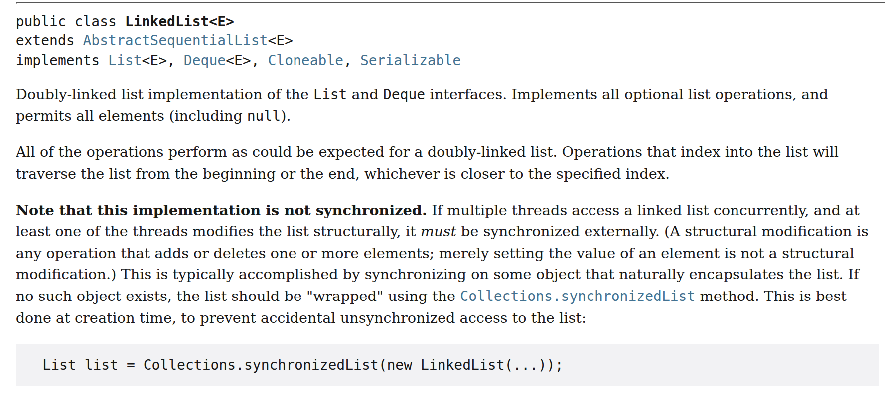
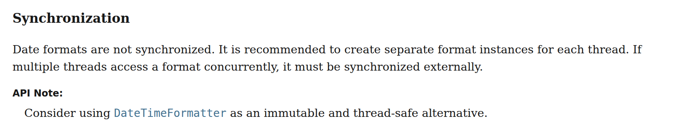
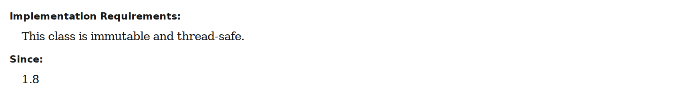
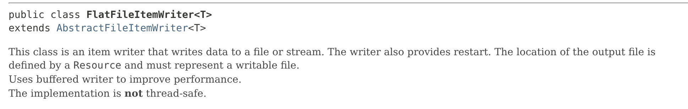
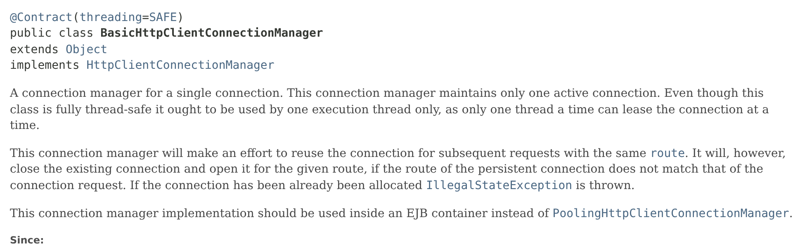
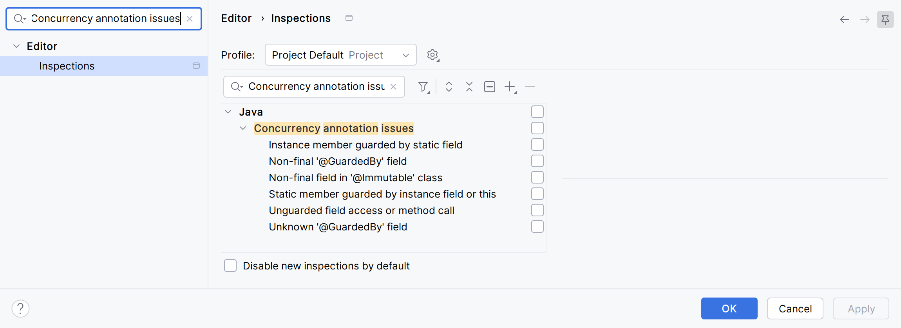

= Documenting and Verifying Thread Safety: Javadoc, Annotations, Static Analysis, and ArchUnit
Sanghyuk Jung
2026-10-03
:jbake-type: post
:jbake-status: published
:jbake-tags: java, concurrency, static-analysis, archunit, spring
:description: How to state thread safety in Javadoc, and how to use annotations, static analysis tools, and ArchUnit tests to keep code that is unsafe under multiple threads from being deployed.
:jbake-og: {"image": "img/thread-safety-annotations/og-intellij-inspections.png"}
:idprefix:
:toc:
:examples-repo: https://github.com/benelog/blog/tree/main/examples
:source-repo: {examples-repo}/thread-safety-archunit
:source-link-base: {source-repo}
:static-analysis-repo: {examples-repo}/thread-safety-static-analysis
:intellij-source-revision: 826413b22cfe5b5c573662f5d2442f454dbc0b23
:intellij-source-short: 826413b22cfe
:intellij-source-base: https://github.com/JetBrains/intellij-community/blob/{intellij-source-revision}
:sonar-java-source-revision: 9bf31b6e003782152b920fac0b1cfa5ba55e05a1
:sonar-java-source-short: 9bf31b6e0037
:sonar-java-source-base: https://github.com/SonarSource/sonar-java/blob/{sonar-java-source-revision}
:eclipse-jdt-source-revision: 8c40c7d2ae12c0a32ab3cca1ab31b53956c65d51
:eclipse-jdt-source-short: 8c40c7d2ae12
:eclipse-jdt-source-base: https://github.com/eclipse-jdt/eclipse.jdt.core/tree/{eclipse-jdt-source-revision}

Whether instances of a class can be shared by multiple threads is information developers need to check carefully. Yet the standard Javadoc tags (`@param`, `@return`, `@throws`, and so on) include no tag for thread safety. As a result, users of a class can easily miss what its provider intended.
This article first looks at a good classification scheme for stating thread safety in Javadoc. It then covers how to use annotations, static analysis tools, and ArchUnit tests to keep code that is unsafe under multiple threads from being deployed.

== Thread Safety in Javadoc

This section covers four topics in order:

* Why Javadoc does not show `synchronized` on methods
* Why a class-level statement is still needed
* A suitable classification for documentation
* Examples from real library documentation

=== Why Javadoc Hides synchronized

When an instance method carries the `synchronized` keyword, the instance itself becomes the lock. Even if several threads call `synchronized` methods on the same instance at the same time, only one thread can enter. The others wait until the first thread leaves the method. A `static synchronized` method uses the `Class` object of its class as the lock. So `synchronized` is a clue to thread safety, and it would seem useful to show it in Javadoc.
Javadoc, however, does not print the `synchronized` keyword in method declarations. Synchronization is considered an implementation detail, not a contract to expose in the API documentation. Item 82 of Effective Java, Third Edition, defends this policy on the same grounds.

`synchronized` on a method declaration is equivalent to wrapping the whole method body in a `synchronized(this)` block. That is, the following code

[source,java]
.synchronized on the method declaration
----
synchronized void run() {
    // do something
}
----

does the same thing as this code:

[source,java]
.The whole method body in a synchronized block
----
void run() {
    synchronized (this) {
        // do something
    }
}
----

As the implementation improves, the synchronized region may shrink to part of the method, or a separate lock object may replace `this`. Such implementation details change more often than the external interface. It is also hard to show every lock-protected region in the method declaration. Some classes synchronize internally with `java.util.concurrent.locks.Lock` or CAS (Compare And Swap) operations. The presence or absence of the `synchronized` keyword therefore cannot be the only criterion for thread safety.

=== The Need for a Class-Level Thread Safety Statement

In a multithreaded environment, each method call may be safe on its own while a combination of calls is not.
For example, a `HashMap` that is safely published after construction (for instance, through a `final` field or a `volatile` variable) and never modified afterward can be read with `get()` from several threads without problems. But if one thread changes its structure with `put()` while another calls `get()`, the result is not guaranteed. The same applies to `Hashtable`, whose public methods are all `synchronized` or delegate to synchronized methods and views, and to a `Map` wrapped with `Collections.synchronizedMap()`. When two calls are combined, such as checking with `containsKey()` and then calling `put()`, a race condition occurs unless the caller holds a lock externally.

What needs documenting, then, is not whether methods are synchronized but under what conditions the class is safe. Since Javadoc has no convention for this, developers have to write it in the class description themselves. The Effective Java classification in the next section provides the criteria.

=== The Five Levels of Thread Safety in Effective Java

Item 82 of Effective Java, Third Edition, "Document thread safety" (Item 70 in the Second Edition), recommends documenting thread safety in five levels.

* Immutable
** The state never changes, so no external synchronization is needed.
** Examples: `String`, `Long`, `BigInteger` (the book's examples), `java.time.LocalDate`
* Unconditionally thread-safe
** The class has mutable state but synchronizes sufficiently inside.
** Examples: `AtomicLong`, `ConcurrentHashMap`
* Conditionally thread-safe
** Some methods require external synchronization to be safe.
** Example: a `List` wrapped with `Collections.synchronizedList()`. While iterating with an iterator, the caller must hold the `List` object as a lock. Otherwise, the behavior is non-deterministic. A fail-fast iterator may throw `ConcurrentModificationException`, but there is no guarantee that it will.
* Not thread-safe
** The caller must synchronize externally.
** Examples: `HashMap`, `ArrayList`
* Thread-hostile
** The class cannot be used by multiple threads even with external synchronization. Classes or methods that modify static data without synchronization fall into this category. Even if each caller locks a different instance, they all end up modifying the same static data concurrently.
** Examples: The Third Edition explains that the `generateSerialNumber` method in Item 78 would be thread-hostile if it incremented a static field without internal synchronization. `System.runFinalizersOnExit()`, the example in the Second Edition, was deprecated in JDK 1.2 and removed in JDK 11.

=== Examples in Class Descriptions

Here are three examples of where and how the Java standard library and Spring Batch describe thread safety.

==== java.util.LinkedList

The https://docs.oracle.com/en/java/javase/25/docs/api/java.base/java/util/LinkedList.html[JDK 25 Javadoc for LinkedList] states in bold, in the third paragraph of the class description, that it is "not synchronized".

==== java.text.SimpleDateFormat

The https://docs.oracle.com/en/java/javase/25/docs/api/java.base/java/text/SimpleDateFormat.html[JDK 25 Javadoc for SimpleDateFormat] has a final section of the class description titled "Synchronization", which says "Date formats are not synchronized". Its "API Note" recommends `DateTimeFormatter` as an "immutable and thread-safe alternative".

The https://docs.oracle.com/en/java/javase/25/docs/api/java.base/java/time/format/DateTimeFormatter.html[JDK 25 Javadoc for DateTimeFormatter] states "This class is immutable and thread-safe." under "Implementation Requirements" at the end of the class description.

The `java.time` package, added in JDK 8, applies this format across the whole package. In the JDK 25 source, 31 of the 43 public classes in `java.time` and its subpackages, including `LocalDate`, `Instant`, and `ZonedDateTime`, state the same sentence in the same place with the Javadoc `@implSpec` tag. All 12 public enums also use a sentence of the same shape, such as "This is an immutable and thread-safe enum." Of the remaining 12 classes, all but the utility class `TemporalQueries` state their immutability or threading conditions in the same section. Exception classes, for example, say "This class is intended for use in a single thread."

That said, this format has not become a standard across the whole JDK.
`@implSpec` is not a standard Javadoc tag. It is a JDK-specific tag registered with the `-tag` option when the JDK is built. If you use it as is in an ordinary project, the JDK 25 `javadoc` command reports the error "unknown tag. Unregistered custom tag?".
Within the JDK, new APIs also differ. `Arena` and `Linker` in `java.lang.foreign`, which became a final API in JDK 22, and `ListFormat`, added in JDK 22, state thread safety in `@implSpec`. In contrast, `HexFormat`, added in JDK 17, writes the same sentence "This class is immutable and thread-safe." in the body without `@implSpec`, and `HttpClient`, added in JDK 11, also says in the body "Once built, an HttpClient is immutable".

==== org.springframework.batch.item.file.FlatFileItemWriter

The https://docs.spring.io/spring-batch/docs/current/api/org/springframework/batch/item/file/FlatFileItemWriter.html[FlatFileItemWriter] Javadoc in Spring Batch 5.2.6 states on the last line of the class description "The implementation is *not* thread-safe.", with only "not" in bold.

As these examples show, each class marks thread safety in a different place and a different way. `LinkedList` and `FlatFileItemWriter` use bold text, and `SimpleDateFormat` uses a separate section heading. All four classes, however, put the statement in the middle or at the end of the class description rather than in the first paragraph, so anyone who does not read the API documentation to the end can easily miss it. I find myself wishing for a rule such as "Put thread safety on the first line of the class description, and always make it stand out."

== Thread Safety with Annotations

Marking thread safety with annotations instead of prose gives it a consistent place and format in Javadoc. When an annotation's declaration carries the `@Documented` meta-annotation, Javadoc prints that annotation as is in the class declaration.
We first look at a project that defined its own annotation for this purpose, and then at annotations that many projects can share.

=== @Contract in Apache HttpClient

https://hc.apache.org/httpcomponents-client-5.5.x/[Apache HttpClient] 5 defines a single annotation for thread safety, `org.apache.hc.core5.annotation.Contract`. Its `threading` attribute takes a value of the https://hc.apache.org/httpcomponents-core-5.3.x/current/httpcore5/apidocs/org/apache/hc/core5/annotation/ThreadingBehavior.html[ThreadingBehavior] enum.

[cols="1,3", options="header"]
|===
|ThreadingBehavior |Meaning

|`IMMUTABLE`
|Fully immutable and thread-safe.

|`IMMUTABLE_CONDITIONAL`
|Immutable if the dependencies injected through the constructor are immutable, and thread-safe if they are thread-safe.

|`STATELESS`
|Stateless and thread-safe.

|`SAFE`
|Thread-safe.

|`SAFE_CONDITIONAL`
|Thread-safe only if the dependencies injected through the constructor are thread-safe.

|`UNSAFE`
|Not thread-safe. This is the default when the `threading` attribute is omitted.
|===

In the HttpClient 5.5 source, the main classes are declared as follows.

[source,java]
.HttpClient 5.5
----
@Contract(threading = ThreadingBehavior.SAFE)
public abstract class CloseableHttpClient implements HttpClient, ModalCloseable {

@Contract(threading = ThreadingBehavior.SAFE_CONDITIONAL)
public class PoolingHttpClientConnectionManager
        implements HttpClientConnectionManager, ConnPoolControl<HttpRoute> {

@Contract(threading = ThreadingBehavior.SAFE)
public class BasicHttpClientConnectionManager implements HttpClientConnectionManager {
----

`SAFE_CONDITIONAL` has a name similar to "conditionally thread-safe" in Effective Java, but it means something different. The Effective Java classification is about which sequences of method calls need external synchronization, while the HttpClient value is about whether the dependencies received through the constructor are thread-safe.

`@Contract` carries the `@Documented` meta-annotation, so it appears in the class declaration in Javadoc. Below is the https://hc.apache.org/httpcomponents-client-5.5.x/current/httpclient5/apidocs/org/apache/hc/client5/http/impl/io/BasicHttpClientConnectionManager.html[Javadoc for BasicHttpClientConnectionManager].

Because it always appears in the same place, thread safety is visible at a glance. The class description also says "this class is fully thread-safe", but the annotation in the declaration catches the eye first.

HttpClient did not start with its own annotation. Up to https://github.com/apache/httpcomponents-client/tree/rel/v4.5.2/httpclient/src/main/java/org/apache/http[HttpClient 4.5.2], `HttpGet` and the classes from the 5.5 example above were declared with `@NotThreadSafe` and `@ThreadSafe`, as shown below.

[source,java]
.HttpClient 4.5.2
----
@NotThreadSafe
public class HttpGet extends HttpRequestBase {

@ThreadSafe
public abstract class CloseableHttpClient implements HttpClient, Closeable {

@ThreadSafe
public class PoolingHttpClientConnectionManager
    implements HttpClientConnectionManager, ConnPoolControl<HttpRoute>, Closeable {

@ThreadSafe
public class BasicHttpClientConnectionManager implements HttpClientConnectionManager, Closeable {
----

These annotations lived in the `org.apache.http.annotation` package, and their Javadoc said they originated in the book "Java Concurrency in Practice". Because of a https://issues.apache.org/jira/browse/HTTPCLIENT-1743[licensing issue] with the original JCIP library, discussed below, HttpCore 4.4.5 removed these four annotations, and HttpClient has used `@Contract` since 4.5.3.

=== JCIP Annotations

Each project can define its own annotations, as HttpClient did. Using annotations from widely adopted open source, however, spares users from learning something new. SpotBugs and IntelliJ IDEA, covered later, include the JCIP package in their default lists of recognized annotations. The JCIP annotations that HttpClient 4.x borrowed are the starting point for such shared annotations.

The https://jcip.net/annotations/doc/net/jcip/annotations/package-summary.html[JCIP annotations] are the thread safety annotations proposed in Appendix A of "Java Concurrency in Practice". There are four:

* `@ThreadSafe`: a thread-safe class
* `@NotThreadSafe`: a class that is not thread-safe
* `@Immutable`: an immutable class. An immutable class is thread-safe.
* `@GuardedBy("lock")`: placed on a field or method to indicate which lock must be held when accessing it. It can name either an intrinsic lock used by `synchronized` or a `java.util.concurrent.locks.Lock`.

The first three annotations tell users about the class's contract, and `@GuardedBy` tells maintainers of the class which lock to respect.

Effective Java, Second Edition (2008) came out after JCIP (2006) and explains its five levels by comparing them with the JCIP annotations.
Lining up the two classifications, the four levels other than thread-hostile map onto the three class-level JCIP annotations. Unconditionally thread-safe and conditionally thread-safe are both covered by `@ThreadSafe`.

[cols="2,2,4", options="header"]
|===
|Effective Java level |JCIP annotation |Difference

|Immutable
|`@Immutable`
|JCIP considers immutable classes thread-safe, so `@ThreadSafe` is not added on top.

|Unconditionally thread-safe
|`@ThreadSafe`
|Same meaning.

|Conditionally thread-safe
|`@ThreadSafe`
|JCIP has no separate name for this. Which lock to hold goes in the description. This is where the two classifications actually diverge.

|Not thread-safe
|`@NotThreadSafe`
|JCIP treats this annotation as optional.

|Thread-hostile
|None
|JCIP has no corresponding concept.

|Not applicable
|`@GuardedBy("lock")`
|Placed on fields and methods, for maintainers. The five levels of Effective Java are a class-level contract with users, so the basis of classification itself is different.
|===

In short, Effective Java divides classes into five levels by how much external synchronization users need. JCIP uses a safe-or-not dichotomy with immutability added as a special case, and separates information for maintainers into `@GuardedBy`. Section 4.5 of JCIP, "Documenting synchronization policies", recommends documenting thread safety guarantees for users and synchronization policies for maintainers.

=== Annotations Spread Under the JCIP Names

The original library distributed with the JCIP book is `net.jcip:jcip-annotations:1.0` on Maven Central. Its license, however, is Creative Commons Attribution, a license that the Creative Commons foundation itself does not recommend for software. That led to https://github.com/stephenc/jcip-annotations[com.github.stephenc.jcip:jcip-annotations:1.0-1], a reimplementation of the same API under the Apache License 2.0. The two libraries share the package name (`net.jcip.annotations`) and the annotation names.

The JCIP annotations have also been copied into several other projects. The following libraries use the same annotation names in different packages.

* `javax.annotation.concurrent`: `com.google.code.findbugs:jsr305`, the JSR-305 annotation implementation distributed by FindBugs, contains the same four annotations. https://jcp.org/en/jsr/proposalDetails?id=305[JSR-305 itself was abandoned without a final release and is dormant]. On Java 9 and 10, the `javax.annotation` package in this jar placed on the module path could conflict with the JDK's `java.xml.ws.annotation` module. That JDK module was https://docs.oracle.com/en/java/javase/26/migrate/removed-tools-components.html[removed in JDK 11], however, so the problem does not apply to every version since Java 9.
* `com.google.errorprone.annotations`: `@Immutable` and `@ThreadSafe` used by Google's Error Prone, plus `@GuardedBy` in the `concurrent` subpackage.
* `androidx.annotation.GuardedBy`: for Android.
* `org.apache.http.annotation`: as seen above, the four annotations Apache HttpComponents copied and used up to 4.5.2. They were replaced by `@Contract` in HttpCore 4.4.5 and HttpClient 4.5.3.

=== Choosing Annotations for Your Purpose

The original JCIP library is hard to recommend for new projects because of its license, and JSR-305 because its standardization was abandoned.
Instead, considering the coverage of the static analysis tools in the next section, I recommend one of the following two libraries.

* If compile-time verification comes first, `error_prone_annotations` is the right fit. With Error Prone, `@Immutable` and `@GuardedBy` can be checked at compile time. Guava declares this library as a compile-scope dependency (as of 33.7.1-jre), so projects that use Guava get it on the compile classpath as a transitive dependency. If you use it directly in code, though, it is safer to declare the dependency explicitly rather than rely on the transitive one. Error Prone does not check `@ThreadSafe`, and the library has no `@NotThreadSafe`. You therefore also need a convention that unmarked classes are considered not thread-safe.
* If expressing all four JCIP annotations in your public API, including `@NotThreadSafe`, comes first, `com.github.stephenc.jcip:jcip-annotations` is the right fit. IntelliJ and SpotBugs include this package (`net.jcip.annotations`) in their default lists, so a project that uses both tools only needs to add one dependency.

== What Static Analysis Tools Check

Annotations are valuable as documentation alone, but they become more useful when tools catch violations. This section describes how far SpotBugs, Error Prone, and IntelliJ IDEA each go. Tool coverage can change between versions, so here are the versions I ran or checked against documentation for this article.

[cols="2,4", options="header"]
.Verification baseline
|===
|Target |Version and how it was checked

|Java
|JDK 25

|SpotBugs
|SpotBugs 4.10.4 with Gradle plugin 6.5.11, run on the examples

|Error Prone
|Error Prone 2.50.0 with Gradle plugin 5.1.1, run on the examples

|IntelliJ IDEA
|Inspectopedia 2026.2 documentation and the inspection registrations in link:{intellij-source-base}/java/java-backend/resources/META-INF/Inspections.xml[IntelliJ Community source {intellij-source-short}]

|SonarQube
|Built-in rules of the Java analyzer in link:{sonar-java-source-base}/java-checks/src/main/java/org/sonar/java/checks/VolatileNonPrimitiveFieldCheck.java[SonarJava source {sonar-java-source-short}] and its list of SpotBugs external rules

|Eclipse JDT
|https://help.eclipse.org/latest/topic/org.eclipse.jdt.doc.isv/guide/jdt_api_options.htm[JDT Core Options] and link:{eclipse-jdt-source-base}[Eclipse JDT source {eclipse-jdt-source-short}]

|===

In the full list of JDT Core Options as of September 2026 and in Eclipse JDT source {eclipse-jdt-source-short}, I found no compiler check that deals with thread safety annotations. Eclipse users can fill the gap with the https://spotbugs.readthedocs.io/en/stable/eclipse.html[SpotBugs Eclipse plugin].

At the same point in time, I searched the built-in rule implementations in SonarJava source {sonar-java-source-short}, the Java analyzer for SonarQube, for `ThreadSafe`, `GuardedBy`, and `javax.annotation.concurrent`. S3077 was the only implementation that referred to thread safety annotations. I found no rule that directly verifies contracts declared with annotations. The link:{sonar-java-source-base}/java-checks/src/main/java/org/sonar/java/checks/VolatileNonPrimitiveFieldCheck.java[S3077 implementation], which flags `volatile` on reference-type fields, makes an exception when the field's type carries `@Immutable` or `@ThreadSafe` from the JSR-305 package. It does not handle `@GuardedBy`.

SonarQube can https://docs.sonarsource.com/sonarqube-server/analyzing-source-code/importing-external-issues/external-analyzer-reports[import SpotBugs reports as external issues]. Its link:{sonar-java-source-base}/external-reports/src/main/resources/org/sonar/l10n/java/rules/spotbugs/spotbugs-rules.json[list of external rules] includes all three bug patterns covered below. To see these results in SonarQube, then, you run SpotBugs in the build to produce an XML report and pass it with `sonar.java.spotbugs.reportPaths`.

The SpotBugs and Error Prone examples are in link:{static-analysis-repo}[examples/thread-safety-static-analysis].

=== SpotBugs

https://spotbugs.github.io/[SpotBugs], the successor to FindBugs, has one bug pattern for the JCIP annotations, and it is for `@Immutable`. `@GuardedBy` and `@ThreadSafe` have no dedicated checks. Instead, a detector that looks for inconsistently synchronized fields reads them as input to its judgment. SpotBugs recognizes three packages:

* `net.jcip.annotations` (original JCIP)
* `javax.annotation.concurrent` (JSR-305)
* `jakarta.annotation.concurrent` (recognized in advance as part of SpotBugs' support for the jakarta namespace; Jakarta Annotations 3.0.0 has no such package)

The https://spotbugs.readthedocs.io/en/latest/bugDescriptions.html#jcip-fields-of-immutable-classes-should-be-final-jcip-field-isnt-final-in-immutable-class[JCIP_FIELD_ISNT_FINAL_IN_IMMUTABLE_CLASS] bug pattern, which dates back to FindBugs 2.0, warns when a class annotated with `@Immutable` has a field that is not `final`. The SpotBugs 4.10.4 implementation, however, excludes `transient` and `volatile` fields from this check.

Create a class declared `@Immutable` that nevertheless has a setter,

[source,java]
.link:{static-analysis-repo}/spotbugs/src/main/java/net/benelog/Memo.java[Memo.java]
----
package net.benelog;

import net.jcip.annotations.Immutable;

/**
 * Declared {@code @Immutable} but has a non-final field, so
 * SpotBugs reports JCIP_FIELD_ISNT_FINAL_IN_IMMUTABLE_CLASS.
 */
@Immutable
public class Memo {
	private String content;

	public void setContent(String content) {
		this.content = content;
	}

	public String getContent() {
		return content;
	}
}
----

configure the https://github.com/spotbugs/spotbugs-gradle-plugin[SpotBugs plugin] in Gradle,

[source,kotlin]
.link:{static-analysis-repo}/spotbugs/build.gradle.kts[spotbugs/build.gradle.kts]
----
plugins {
	java
	id("com.github.spotbugs") version "6.5.11"
}

repositories {
	mavenCentral()
}

dependencies {
	implementation("com.github.stephenc.jcip:jcip-annotations:1.0-1")
}

java {
	toolchain {
		languageVersion.set(JavaLanguageVersion.of(25))
	}
}

spotbugs {
	toolVersion.set("4.10.4")
	ignoreFailures.set(true)
	if (project.hasProperty("reportLow")) {
		// Report low-priority warnings too. The default reports medium and above only.
		reportLevel.set(com.github.spotbugs.snom.Confidence.LOW)
	}
}

tasks.spotbugsMain {
	val report = layout.buildDirectory.file("reports/spotbugs/main.txt")
	reports.create("text") {
		required.set(true)
		outputLocation.set(report)
	}
	doLast {
		println(report.get().asFile.readText())
	}
}
----

and run `./gradlew :spotbugs:spotbugsMain`. The report contains this line:

[source]
----
M B JCIP: Memo.content should be final since net.benelog.Memo is marked as Immutable.  In Memo.java
----

The example sets `ignoreFailures` to `true` so that the report is printed in full even when there are warnings. To fail the build on violations in real CI, change this setting to `false` or omit it.

`@GuardedBy` is handled by the https://spotbugs.readthedocs.io/en/latest/bugDescriptions.html#is-field-not-guarded-against-concurrent-access-is-field-not-guarded[IS_FIELD_NOT_GUARDED] bug pattern. This pattern, however, does not find violations by looking at the annotation. The https://spotbugs.readthedocs.io/en/latest/bugDescriptions.html#is-inconsistent-synchronization-is2-inconsistent-sync[IS2_INCONSISTENT_SYNC] detector estimates missing synchronization from the proportion of field accesses made while holding a lock. When a field carries `@GuardedBy("this")`, the detector treats it differently in three ways:

* It renames the bug pattern to IS_FIELD_NOT_GUARDED.
* It keeps fields as candidates even if no access holds the lock.
* It raises the warning priority.

The only value it recognizes is `"this"`. The detector treats fields where less than half of the accesses hold the lock as likely false positives and lowers their priority.

That is why link:{static-analysis-repo}/spotbugs/src/main/java/net/benelog/Counter.java[Counter] in the same project is not reported with the default settings, even though it modifies a `@GuardedBy("this")` field without a lock. The read and write in `increment()` happen without a lock, and only the read in the `synchronized` method `get()` holds it. One of three accesses, or 33%, holds the lock. Only when you make the example report low-priority warnings too with `./gradlew :spotbugs:spotbugsMain -PreportLow` does it appear.

[source]
----
L M IS: Counter.count not guarded against concurrent access; locked 33% of time  Unsynchronized access at Counter.java:[line 16]
----

The class below has the same violation plus two more `synchronized` methods, which brings the locked accesses to 60%.

[source,java]
.link:{static-analysis-repo}/spotbugs/src/main/java/net/benelog/LockedCounter.java[LockedCounter.java]
----
package net.benelog;

import net.jcip.annotations.GuardedBy;
import net.jcip.annotations.ThreadSafe;

/**
 * Same violation as Counter, but more synchronized methods raise
 * the proportion of locked accesses. SpotBugs reports IS_FIELD_NOT_GUARDED.
 */
@ThreadSafe
public class LockedCounter {
	@GuardedBy("this")
	private int count;

	public void increment() {
		count++;
	}

	public synchronized int get() {
		return count;
	}

	public synchronized void reset() {
		count = 0;
	}

	public synchronized boolean isZero() {
		return count == 0;
	}
}
----

This class is reported with high priority even with the default settings. The first letter of the output is the priority and the second is the category.

[source]
----
H M IS: LockedCounter.count not guarded against concurrent access; locked 60% of time  Unsynchronized access at LockedCounter.java:[line 16]
----

The same detector also reads `@ThreadSafe` and `@NotThreadSafe`. It excludes fields of `@NotThreadSafe` classes from the check and uses `@ThreadSafe` on a class as grounds for raising the warning priority of its fields. It does not verify that the contract declared by the annotation is kept. A class declared `@ThreadSafe` can hold a field of a `@NotThreadSafe` type without a warning.

In short, the only thing SpotBugs checks deterministically from annotations alone is the `final` rule for `@Immutable` classes. `@GuardedBy` violations are also reported as estimates based on the proportion of locked accesses; the annotation only changes the candidates and priority of that estimate.

=== Error Prone

Google's https://errorprone.info/[Error Prone] plugs into `javac` and checks rules that prevent errors at compile time.

==== Checking @GuardedBy

Error Prone's https://errorprone.info/bugpattern/GuardedBy[GuardedBy check] reports a compile error when a field or method annotated with `@GuardedBy(lock)` is accessed without holding the specified lock. Unlike SpotBugs, whose reporting depends on access proportions, it decides for each access within its analysis scope whether the lock is held. It does not check accesses inside constructors and initializer blocks, or fields protected by a `ReadWriteLock`.

The annotations this check recognizes include:

* `com.google.errorprone.annotations.concurrent.GuardedBy`
* `javax.annotation.concurrent.GuardedBy`
* `androidx.annotation.GuardedBy` for Android

The original JCIP `net.jcip.annotations.GuardedBy` is not on the list. The documentation states that the `@Immutable` check targets only `com.google.errorprone.annotations.Immutable` and excludes `javax.annotation.concurrent.Immutable`. The next section confirms this.

In Gradle, the https://github.com/tbroyer/gradle-errorprone-plugin[net.ltgt.errorprone plugin] attaches Error Prone to `javac`. To compare annotations from three packages, the example includes all three libraries.

[source,kotlin]
.link:{static-analysis-repo}/errorprone/build.gradle.kts[errorprone/build.gradle.kts]
----
plugins {
	java
	id("net.ltgt.errorprone") version "5.1.1"
}

repositories {
	mavenCentral()
}

dependencies {
	implementation("com.github.stephenc.jcip:jcip-annotations:1.0-1")
	implementation("com.google.code.findbugs:jsr305:3.0.2")
	implementation("com.google.errorprone:error_prone_annotations:2.50.0")
	errorprone("com.google.errorprone:error_prone_core:2.50.0")
}

java {
	toolchain {
		languageVersion.set(JavaLanguageVersion.of(25))
	}
}
----

Compiling the following class, which uses the JSR-305 `@GuardedBy`,

[source,java]
.link:{static-analysis-repo}/errorprone/src/main/java/net/benelog/JsrCounter.java[JsrCounter.java]
----
package net.benelog;

import javax.annotation.concurrent.GuardedBy;
import javax.annotation.concurrent.ThreadSafe;

/**
 * JSR-305 package. Error Prone reports the @GuardedBy violation as a compile error.
 */
@ThreadSafe
public class JsrCounter {
	@GuardedBy("this")
	private int count;

	public void increment() {
		count++;
	}

	public synchronized int get() {
		return count;
	}
}
----

makes Error Prone 2.50.0 report this error:

[source]
----
JsrCounter.java:15: error: [GuardedBy] This access should be guarded by 'this', which is not currently held
		count++;
		^
    (see https://errorprone.info/bugpattern/GuardedBy)
----

link:{static-analysis-repo}/errorprone/src/main/java/net/benelog/JcipCounter.java[JcipCounter], the same code with only the import changed to `net.jcip.annotations.GuardedBy`, compiles without any error. Conversely, link:{static-analysis-repo}/errorprone/src/main/java/net/benelog/ErrorProneCounter.java[ErrorProneCounter], which uses `@GuardedBy` from Error Prone's own package, is caught with the same error as JsrCounter. The three classes are in the errorprone subproject of the example repository, and you can check them with `./gradlew :errorprone:compileJava`.

==== Checking @Immutable

The https://errorprone.info/bugpattern/Immutable[Immutable check] verifies that a class annotated with `com.google.errorprone.annotations.Immutable` is deeply immutable. The SpotBugs JCIP check only looks at whether fields are `final`, while Error Prone also checks whether the types of reference fields are immutable. The conservative definition of immutability in the Error Prone documentation also requires that `this` not escape from the constructor. The `ImmutableChecker` in 2.50.0, however, does not analyze `this` escaping from ordinary constructor bodies. The class below has one field that is not `final` and one field that is `final` but of a mutable type.

[source,java]
.link:{static-analysis-repo}/errorprone/src/main/java/net/benelog/ErrorProneMemo.java[ErrorProneMemo.java]
----
package net.benelog;

import java.util.List;

import com.google.errorprone.annotations.Immutable;

/**
 * @Immutable from Error Prone's own package. Both the non-final field and
 * the final field of a mutable type are reported as compile errors.
 */
@Immutable
public class ErrorProneMemo {
	private String content;
	private final List<String> tags;

	public ErrorProneMemo(String content, List<String> tags) {
		this.content = content;
		this.tags = tags;
	}

	public String getContent() {
		return content;
	}

	public List<String> getTags() {
		return tags;
	}
}
----

Both fields are reported as compile errors.

[source]
----
ErrorProneMemo.java:13: error: [Immutable] type annotated with @Immutable could not be proven immutable: 'ErrorProneMemo' has non-final field 'content'
	private String content;
	               ^
    (see https://errorprone.info/bugpattern/Immutable)
  Did you mean 'private final String content;'?
ErrorProneMemo.java:14: error: [Immutable] type annotated with @Immutable could not be proven immutable: 'ErrorProneMemo' has field 'tags' of type 'java.util.List<java.lang.String>', 'List' is mutable
	private final List<String> tags;
	                           ^
    (see https://errorprone.info/bugpattern/Immutable)
----

For `tags` to pass, its type must be one that Error Prone knows to be immutable or one annotated with `@Immutable`. A class that implements an interface annotated with `@Immutable` is subject to the same check. For generic classes, the `containerOf` attribute specifies which type parameters must be immutable.

link:{static-analysis-repo}/errorprone/src/main/java/net/benelog/JsrMemo.java[JsrMemo], the same code with only the import changed to `javax.annotation.concurrent.Immutable`, compiles without errors. `@GuardedBy` is checked for the JSR-305 package too, but `@Immutable` is checked only for Error Prone's own package.

==== Checking @ThreadSafe

`com.google.errorprone.annotations.ThreadSafe` also has a https://errorprone.info/bugpattern/ThreadSafe[ThreadSafe check] page. It sits in the "Experimental" group of the bug pattern list, so it looks as if you only need to turn it on, but in fact you cannot. Enabling it in the Gradle plugin with `options.errorprone.error("ThreadSafe")` fails the build with the error "ThreadSafe is not a valid checker name". `BuiltInCheckerSuppliers`, the list of built-in checks in the Error Prone 2.50.0 source, contains `GuardedByChecker` and `ImmutableChecker` but not `ThreadSafeChecker`. It was also missing from the earlier versions I checked, 2.3.0 through 2.45.0. The checker class itself is included in the `error_prone_core` jar.

So the class below compiles without any error under the default settings.

[source,java]
.link:{static-analysis-repo}/errorprone/src/main/java/net/benelog/ErrorProneRegistry.java[ErrorProneRegistry.java]
----
package net.benelog;

import java.util.HashMap;
import java.util.Map;
import java.util.concurrent.ConcurrentHashMap;

import com.google.errorprone.annotations.ThreadSafe;

/**
 * @ThreadSafe from Error Prone's own package. Error Prone 2.50.0 does not check it by default.
 * Registering ThreadSafeChecker with -PthreadSafeCheck reports fields modified without a lock
 * and final fields of non-thread-safe types as compile errors.
 */
@ThreadSafe
public class ErrorProneRegistry {
	private int count;
	private final Map<String, String> entries = new HashMap<>();
	private final ConcurrentHashMap<String, String> safeEntries = new ConcurrentHashMap<>();

	public void register(String key, String value) {
		count++;
		entries.put(key, value);
		safeEntries.put(key, value);
	}

	public int getCount() {
		return count;
	}
}
----

To see what this checker looks at, I created the link:{static-analysis-repo}/threadsafe-check[threadsafe-check] subproject in the example repository. It is experimental code that registers a subclass of `ThreadSafeChecker` in `META-INF/services` so that Error Prone loads it as a plugin check. Error Prone uses ServiceLoader to find checks on the compiler's annotation processor path, with `com.google.errorprone.bugpatterns.BugChecker` as the service interface. So all you need is a file with that name that lists the checker class name.

[source]
.link:{static-analysis-repo}/threadsafe-check/src/main/resources/META-INF/services/com.google.errorprone.bugpatterns.BugChecker[META-INF/services/com.google.errorprone.bugpatterns.BugChecker]
----
com.google.errorprone.bugpatterns.threadsafety.ThreadSafeCheck
----

The registered class is a wrapper that extends `ThreadSafeChecker` and names the check with `@BugPattern`. Because the constructor of `ThreadSafeChecker` is package-private, the wrapper uses the same package name. It also has a nominal public no-argument constructor, which ServiceLoader requires. Since this code depends on the internals of 2.50.0, I do not recommend it for real projects.

[source,java]
.link:{static-analysis-repo}/threadsafe-check/src/main/java/com/google/errorprone/bugpatterns/threadsafety/ThreadSafeCheck.java[ThreadSafeCheck.java]
----
package com.google.errorprone.bugpatterns.threadsafety;

@BugPattern(
		name = "ThreadSafe",
		summary = "Type declaration annotated with @ThreadSafe is not thread safe",
		severity = ERROR)
public class ThreadSafeCheck extends ThreadSafeChecker {

	/** Public no-argument constructor required by ServiceLoader. Error Prone uses the @Inject constructor. */
	public ThreadSafeCheck() {
		super(null, null);
	}

	@Inject
	ThreadSafeCheck(WellKnownThreadSafety wellKnownThreadSafety,
			ThreadSafeAnalysis.Factory threadSafeAnalysisFactory) {
		super(wellKnownThreadSafety, threadSafeAnalysisFactory);
	}
}
----

Adding this subproject as a dependency in the `errorprone` configuration of the project under analysis registers it as a plugin check. The example adds it only when a Gradle property is present; this part was omitted from the `build.gradle.kts` quoted earlier.

[source,kotlin]
.link:{static-analysis-repo}/errorprone/build.gradle.kts[errorprone/build.gradle.kts]
----
dependencies {
	errorprone("com.google.errorprone:error_prone_core:2.50.0")
	if (project.hasProperty("threadSafeCheck")) {
		// Register ThreadSafeChecker, which is not in the default check list, as a plugin.
		errorprone(project(":threadsafe-check"))
	}
}
----

Running `./gradlew :errorprone:compileJava -PthreadSafeCheck` reports the following:

[source]
----
ErrorProneRegistry.java:16: error: [ThreadSafe] @ThreadSafe class fields should be final or annotated with @GuardedBy. See https://errorprone.info/bugpattern/ThreadSafe for details.
	private int count;
	            ^
    (see https://errorprone.info/bugpattern/ThreadSafe)
  Did you mean 'private final int count;'?
ErrorProneRegistry.java:17: error: [ThreadSafe] @ThreadSafe class has non-thread-safe field, 'Map' is not thread-safe
	private final Map<String, String> entries = new HashMap<>();
	                                  ^
    (see https://errorprone.info/bugpattern/ThreadSafe)
----

To pass this check, every instance field must be one of the following:

* `final`, with a declared type that Error Prone knows to be thread-safe
* annotated with `@GuardedBy`

`static` fields are not checked, and `@LazyInit` fields are exempt from the `final` requirement. `count` is caught because it is neither `final` nor `@GuardedBy`. `entries` is caught because its declared type `Map` is not a thread-safe type. Even if the actual object is a `ConcurrentHashMap`, a field declared as `Map` is caught. `safeEntries`, whose declared type is also `ConcurrentHashMap`, passes. ErrorProneCounter, shown earlier, passes this check because `count` has `@GuardedBy("this")`, and is caught only by the `@GuardedBy` check.

In short, as of September 2026, Error Prone checks `@Immutable` and `@GuardedBy`, but `@ThreadSafe` serves only as documentation unless you register the checker yourself as a plugin, as shown above.

=== IntelliJ IDEA

IntelliJ IDEA 2026.2 has six inspections in the https://www.jetbrains.com/help/inspectopedia/Java-Concurrency-annotation-issues.html[Concurrency annotation issues] group. Five are for `@GuardedBy` and one is for `@Immutable`. No inspection verifies contracts declared with `@ThreadSafe`.

The https://www.jetbrains.com/help/inspectopedia/FieldAccessNotGuarded.html[Unguarded field access or method call] inspection recognizes `@GuardedBy` from all of these packages:

* `net.jcip.annotations`
* `javax.annotation.concurrent`
* `org.apache.http.annotation`
* `com.android.annotations.concurrency`
* `androidx.annotation`
* `com.google.errorprone.annotations.concurrent`

SpotBugs also reads the original JCIP package, but it handles only `@GuardedBy("this")` and stops at warnings guessed from access proportions. IntelliJ, by comparison, directly checks the guard expressions of the original JCIP annotation.

The https://www.jetbrains.com/help/inspectopedia/NonFinalFieldInImmutable.html[Non-final field in @Immutable class] inspection warns when an `@Immutable` class has a field that is not `final`. It does not check whether field types are mutable, so its depth is closer to SpotBugs than to Error Prone. Unlike SpotBugs, though, it also warns about `transient` and `volatile` fields. The markers this inspection recognizes are:

* `@Immutable` in the original JCIP and JSR-305 packages
* Error Prone's `com.google.errorprone.annotations.Immutable`
* AutoValue's `@AutoValue`
* The Javadoc `@Immutable` tag

`@ThreadSafe` is read only as a hint by the https://www.jetbrains.com/help/inspectopedia/AccessToStaticFieldLockedOnInstance.html[Access to static field locked on instance] inspection in the "Threading issues" group. This inspection warns when code holding an instance lock accesses a non-constant `static` field. If the accessed field is `final`, it link:{intellij-source-base}/java/java-impl-inspections/src/com/siyeh/ig/threading/AccessToStaticFieldLockedOnInstanceInspection.java[checks the annotations on the field's declared type] and skips the warning if a registered thread safety annotation is present. It therefore does not verify the contract of the annotated class itself. The link:{intellij-source-base}/java/java-psi-api/src/com/intellij/codeInsight/ConcurrencyAnnotationsManager.java[default list] contains these annotations:

* `@ThreadSafe` in the original JCIP, JSR-305, `org.apache.http.annotation`, and `com.android.annotations.concurrency` packages
* `@AnyThread` in the `androidx.annotation` and `android.support.annotation` packages

Error Prone's `@ThreadSafe` is not in the default list.

However, the link:{intellij-source-base}/java/java-backend/resources/META-INF/Inspections.xml[inspection registrations] in IntelliJ IDEA 2026.2 declare every inspection in the "Concurrency annotation issues" group with `enabledByDefault="false"` and `level="WARNING"`. You have to turn them on yourself under Settings | Editor | Inspections | Java | Concurrency annotation issues. Even when enabled, they are editor warnings and cannot block `javac` compilation the way Error Prone does. Enforcing them in CI requires a separate runner such as Qodana. https://www.jetbrains.com/help/qodana/about-qodana.html[Qodana] is a code quality platform from JetBrains that runs the same inspections as IntelliJ IDEA in CI, as a Docker image or a command-line tool. You enable the checks in a https://www.jetbrains.com/help/qodana/inspection-profiles.html[Qodana profile] and set a https://www.jetbrains.com/help/qodana/quality-gate.html[failure condition].

Across the three tools, the range checked deterministically from annotations alone is narrow.

* SpotBugs directly checks only the `final` rule for `@Immutable` classes. It guesses `@GuardedBy` violations from the proportion of locked accesses, and reads `@ThreadSafe` and `@NotThreadSafe` only as input to that guess.
* Error Prone catches missing locks for `@GuardedBy` and deep immutability for `@Immutable` as compile errors. It does not recognize the original JCIP package, however, and the `@ThreadSafe` check works only if you register it separately.
* IntelliJ IDEA directly checks `@GuardedBy` from many packages, including the original JCIP, and checks `@Immutable` at about the same depth as SpotBugs. Its inspections are off by default, though, and are not tied to `javac` compilation. Enforcing them requires a separate runner such as Qodana or a command-line inspection.

This is why I recommended either `error_prone_annotations` or `jcip-annotations` earlier. If you need checks that block compilation, use annotations that Error Prone recognizes. If you want to mark all four annotations and still get checks from your IDE and SpotBugs, use the `net.jcip.annotations` package (the Apache-licensed reimplementation).

== Project-Specific Rules Verified with ArchUnit

The static analysis tools above partially check whether a class carrying an annotation is implemented as declared. Application code, however, has another kind of accident: an object shared by multiple threads holds, as a field and without synchronization, a class marked as not thread-safe.

For example, Spring `@RestController` and `@Service` beans are singletons unless a separate scope is specified, so all request threads share their fields. You could use another scope such as request scope. Some projects, however, prevent the problem by making it a policy that controllers must not hold such types as fields at all.
Rules like this depend on the structure each project aims for, so general-purpose static analysis tools do not have them. With https://www.archunit.org/[ArchUnit], you can write such a rule as a JUnit test and check it on every build.

=== Example Code

The example has a class annotated with `@NotThreadSafe` and a controller that holds it as a field. The controller also has a `SimpleDateFormat` field. The full project is in link:{source-repo}[examples/thread-safety-archunit].

[source,java]
.link:{source-link-base}/src/main/java/net/benelog/report/ReportFormatter.java[ReportFormatter.java]
----
package net.benelog.report;

import net.jcip.annotations.NotThreadSafe;

@NotThreadSafe
public class ReportFormatter {
	private final StringBuilder buffer = new StringBuilder();

	public String format(String title, String body) {
		buffer.setLength(0);
		return buffer.append(title).append('\n').append(body).toString();
	}
}
----

[source,java]
.link:{source-link-base}/src/main/java/net/benelog/web/ReportController.java[ReportController.java]
----
package net.benelog.web;

import java.text.SimpleDateFormat;
import java.util.Date;

import net.benelog.report.ReportFormatter;
import net.benelog.report.ReportService;
import org.springframework.web.bind.annotation.GetMapping;
import org.springframework.web.bind.annotation.PathVariable;
import org.springframework.web.bind.annotation.RestController;

@RestController
public class ReportController {
	private final ReportService reportService;
	private final ReportFormatter formatter = new ReportFormatter();
	private final SimpleDateFormat dateFormat = new SimpleDateFormat("yyyy-MM-dd");

	public ReportController(ReportService reportService) {
		this.reportService = reportService;
	}

	@GetMapping("/reports/{id}")
	public String report(@PathVariable long id) {
		return formatter.format(dateFormat.format(new Date()), reportService.find(id));
	}
}
----

=== Rules and Results

The ArchUnit test consists of two rules.

The first rule fails if the type of any field in a class annotated with `@RestController` carries `@NotThreadSafe`, without separately analyzing external synchronization or bean scope. ArchUnit reads annotations from bytecode. It can therefore check annotations with RUNTIME retention, such as the original JCIP annotations, as well as those with CLASS retention, such as the JSR-305 annotations and HttpClient's `@Contract`. The example rule looks only at `net.jcip.annotations.NotThreadSafe`, though, so checking annotations from other packages or the `threading` value of `@Contract` requires additional conditions. Library classes outside the analyzed packages are also read from the classpath under the default settings, so the same rule can check `@NotThreadSafe` that a library has applied.

The second rule is for JDK classes that carry no thread safety annotation, such as `SimpleDateFormat`. It lists `Format`, `Calendar`, and `StringBuilder` explicitly.

[source,java]
.link:{source-link-base}/src/test/java/net/benelog/ThreadSafetyArchTest.java[ThreadSafetyArchTest.java]
----
package net.benelog;

import static com.tngtech.archunit.core.domain.JavaClass.Predicates.assignableTo;
import static com.tngtech.archunit.core.domain.properties.CanBeAnnotated.Predicates.annotatedWith;
import static com.tngtech.archunit.lang.syntax.ArchRuleDefinition.fields;

import java.text.Format;
import java.util.Calendar;

import com.tngtech.archunit.base.DescribedPredicate;
import com.tngtech.archunit.core.domain.JavaClass;
import com.tngtech.archunit.junit.AnalyzeClasses;
import com.tngtech.archunit.junit.ArchTest;
import com.tngtech.archunit.lang.ArchRule;
import net.jcip.annotations.NotThreadSafe;
import org.springframework.web.bind.annotation.RestController;

@AnalyzeClasses(packages = "net.benelog")
class ThreadSafetyArchTest {

	@ArchTest
	static final ArchRule controllers_should_not_hold_not_thread_safe_types =
			fields().that().areDeclaredInClassesThat().areAnnotatedWith(RestController.class)
					.should().notHaveRawType(annotatedWith(NotThreadSafe.class))
					.because("controllers are singletons by default, so all request threads share their fields");

	private static final DescribedPredicate<JavaClass> KNOWN_NOT_THREAD_SAFE_JDK_TYPES =
			assignableTo(Format.class)
					.or(assignableTo(Calendar.class))
					.or(assignableTo(StringBuilder.class))
					.as("JDK types that are not thread-safe (Format, Calendar, StringBuilder)");

	@ArchTest
	static final ArchRule controllers_should_not_hold_known_not_thread_safe_jdk_types =
			fields().that().areDeclaredInClassesThat().areAnnotatedWith(RestController.class)
					.should().notHaveRawType(KNOWN_NOT_THREAD_SAFE_JDK_TYPES)
					.because("JDK classes carry no thread safety annotations, so a list blocks them");
}
----

Running `./gradlew test` with ArchUnit 1.5.0, Spring Web 7.0.9, JUnit 6.1.3, and JDK 25 fails both rules and reports which field broke each rule.

[source]
----
Architecture Violation [Priority: MEDIUM] - Rule 'fields that are declared in classes that are annotated with @RestController should not have raw type annotated with @NotThreadSafe, because controllers are singletons by default, so all request threads share their fields' was violated (1 times):
Field <net.benelog.web.ReportController.formatter> has raw type annotated with @NotThreadSafe in (ReportController.java:0)

Architecture Violation [Priority: MEDIUM] - Rule 'fields that are declared in classes that are annotated with @RestController should not have raw type JDK types that are not thread-safe (Format, Calendar, StringBuilder), because JDK classes carry no thread safety annotations, so a list blocks them' was violated (1 times):
Field <net.benelog.web.ReportController.dateFormat> has raw type JDK types that are not thread-safe (Format, Calendar, StringBuilder) in (ReportController.java:0)
----

link:{source-link-base}/src/main/java/net/benelog/web/HealthController.java[HealthController] in the same project, which holds only `Clock` and `DateTimeFormatter` as fields, passed both rules.

`ReportController`, caught by the rules, can be fixed by holding the immutable `DateTimeFormatter` as a field instead of `SimpleDateFormat`, and by confining `ReportFormatter` to a local variable of the request-handling method.

[source,java]
.ReportController after the fix
----
private static final DateTimeFormatter DATE_FORMAT = DateTimeFormatter.ofPattern("yyyy-MM-dd");

@GetMapping("/reports/{id}")
public String report(@PathVariable long id) {
	ReportFormatter formatter = new ReportFormatter();
	return formatter.format(DATE_FORMAT.format(LocalDate.now()), reportService.find(id));
}
----

After changing `ReportController` this way and running the test again, both rules pass. `ReportFormatter` is created anew on each call and is not shared with other request threads. Passing the rules, however, does not prove the thread safety of the whole controller. Other shared state and race conditions in sequences of method calls need separate review.

This approach also has limits.

* In this rule, ArchUnit looks only at the raw declared type of a field. It cannot catch an `ArrayList` assigned to a field declared as `List`, or a non-thread-safe type used as a generic type argument.
* It also misses cases where only a supertype carries the annotation and the actual declared type does not, unless you traverse the hierarchy separately.
* The rule does not judge whether field access is protected by an external lock or whether the controller has a separate scope.
* JDK types without annotations require a manually maintained list, as in the second rule.
* The rule looks only at fields declared directly in classes annotated with `@RestController`. It therefore also misses fields inherited from an unannotated superclass.

== Summary

When a Java class is used by multiple threads in a way it was not designed for, the side effects are serious and the source of the problem is hard to trace. That is why thread safety must be documented clearly. Writing it in Javadoc prose, however, leaves its place and wording different in every class, and it works only if people read carefully.

Marking thread safety with annotations gives it a consistent place and format and makes it readable by tools. I recommend Error Prone's annotations or the Apache-licensed reimplementation of the JCIP annotations. Error Prone blocks `@GuardedBy` and `@Immutable` violations with compile errors, IntelliJ IDEA reports some violations as editor warnings, and SpotBugs reports some in its analysis reports. None of the three tools, however, verifies contracts declared with `@ThreadSafe` under default settings.

For thread safety rules specific to your project, I recommend checking them with ArchUnit.

== References

* Books
** https://www.oreilly.com/library/view/effective-java-3rd/9780134686097/[Effective Java, Third Edition]: Item 82. Document thread safety
** https://jcip.net/[Java Concurrency in Practice]: 4.5 Documenting synchronization policies, Appendix A. Annotations for Concurrency
* Annotation libraries
** https://jcip.net/annotations/doc/net/jcip/annotations/package-summary.html[JCIP annotations Javadoc]
** https://github.com/stephenc/jcip-annotations[JCIP Annotations under Apache License]
** https://errorprone.info/api/latest/com/google/errorprone/annotations/package-summary.html[Error Prone annotations Javadoc]
** https://github.com/google/guava/issues/2960[Guava issue #2960: Migrate off of jsr305]
* Javadoc examples
** https://docs.oracle.com/javase/specs/jls/se25/html/jls-8.html#jls-8.4.3.6[JLS 25: synchronized Methods]
** https://docs.oracle.com/en/java/javase/25/docs/api/java.base/java/util/LinkedList.html[JDK 25 LinkedList Javadoc]
** https://docs.oracle.com/en/java/javase/25/docs/api/java.base/java/util/Collections.html#synchronizedList(java.util.List)[JDK 25 Collections.synchronizedList Javadoc]
** https://docs.oracle.com/en/java/javase/25/docs/api/java.base/java/util/ConcurrentModificationException.html[JDK 25 ConcurrentModificationException Javadoc]
** https://docs.oracle.com/en/java/javase/25/docs/api/java.base/java/text/SimpleDateFormat.html[JDK 25 SimpleDateFormat Javadoc]
** https://docs.oracle.com/en/java/javase/25/docs/api/java.base/java/time/format/DateTimeFormatter.html[JDK 25 DateTimeFormatter Javadoc]
** https://bugs.openjdk.org/browse/JDK-8198249[JDK-8198249: Remove deprecated Runtime::runFinalizersOnExit and System::runFinalizersOnExit]
** https://docs.spring.io/spring-batch/docs/current/api/org/springframework/batch/item/file/FlatFileItemWriter.html[Spring Batch FlatFileItemWriter Javadoc]
** https://hc.apache.org/httpcomponents-core-5.3.x/current/httpcore5/apidocs/org/apache/hc/core5/annotation/ThreadingBehavior.html[HttpCore 5 ThreadingBehavior Javadoc]
** https://github.com/apache/httpcomponents-client/tree/rel/v5.5/httpclient5/src/main/java/org/apache/hc/client5/http/impl[HttpClient 5.5 source]
** https://github.com/apache/httpcomponents-client/tree/rel/v4.5.2/httpclient/src/main/java/org/apache/http[HttpClient 4.5.2 source]
** https://issues.apache.org/jira/browse/HTTPCLIENT-1743[HTTPCLIENT-1743: Migrate from CC-BY licensed source]
** https://github.com/apache/httpcomponents-core/blob/4.4.x/RELEASE_NOTES.txt[HttpCore 4.4.x Release Notes]: Release 4.4.5
* Static analysis tools
** SpotBugs
*** https://spotbugs.readthedocs.io/en/latest/bugDescriptions.html[SpotBugs Bug descriptions]
*** https://spotbugs.readthedocs.io/en/stable/eclipse.html[SpotBugs Eclipse plugin]
** Error Prone
*** https://errorprone.info/bugpattern/GuardedBy[Error Prone: GuardedBy]
*** https://errorprone.info/bugpattern/Immutable[Error Prone: Immutable]
** SonarQube
*** link:{sonar-java-source-base}/java-checks/src/main/java/org/sonar/java/checks/VolatileNonPrimitiveFieldCheck.java[SonarJava: S3077 implementation ({sonar-java-source-short})]
*** https://docs.sonarsource.com/sonarqube-server/analyzing-source-code/importing-external-issues/external-analyzer-reports[SonarQube: External analyzer reports]
** IntelliJ
*** https://www.jetbrains.com/help/inspectopedia/Java-Concurrency-annotation-issues.html[IntelliJ IDEA Inspectopedia: Concurrency annotation issues]
*** https://www.jetbrains.com/help/inspectopedia/FieldAccessNotGuarded.html[IntelliJ IDEA Inspectopedia: Unguarded field access or method call]
*** https://www.jetbrains.com/help/inspectopedia/NonFinalFieldInImmutable.html[IntelliJ IDEA Inspectopedia: Non-final field in @Immutable class]
*** https://www.jetbrains.com/help/inspectopedia/AccessToStaticFieldLockedOnInstance.html[IntelliJ IDEA Inspectopedia: Access to static field locked on instance]
*** link:{intellij-source-base}/java/java-psi-api/src/com/intellij/codeInsight/ConcurrencyAnnotationsManager.java[IntelliJ Community: ConcurrencyAnnotationsManager ({intellij-source-short})]
*** https://www.jetbrains.com/help/qodana/about-qodana.html[About Qodana]
*** https://www.jetbrains.com/help/qodana/quality-gate.html[Qodana Quality gate]
** https://help.eclipse.org/latest/topic/org.eclipse.jdt.doc.isv/guide/jdt_api_options.htm[Eclipse JDT Core Options]
* https://docs.spring.io/spring-framework/reference/core/beans/factory-scopes.html[Spring Framework Bean Scopes]
* https://www.archunit.org/userguide/html/000_Index.html[ArchUnit User Guide]
